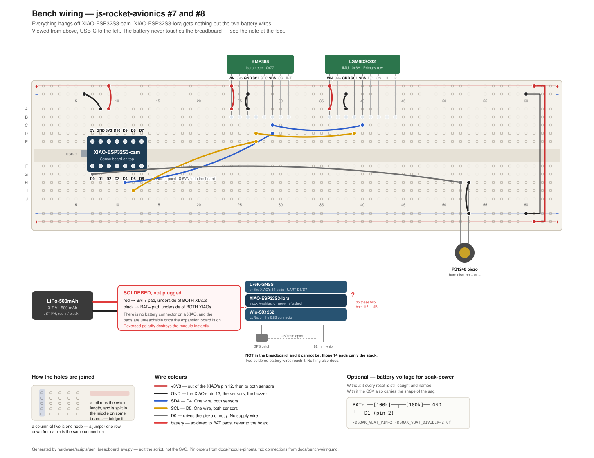

# Bench wiring

__This page is the first one.__ [bench-bringup.md](bench-bringup.md) says what to run and in what order; it assumes the thing is already wired. This says how to wire it, physically, on a breadboard, with nothing taken as known.

## The words this project keeps using

| Word used here | What it actually is |
|---|---|
| __battery__ | [LiPo-500mAh](../hardware/LiPo-500mAh.md) — one LiPo pouch, 500 mAh, 3.7 V, 29 × 36 × 4.75 mm, a red and a black wire ending in a small white 2-pin plug. __One battery, feeding both boards__, rather than one each. Older commits and GitHub issues call this "the cell"; it is the same object and the word has been dropped |
| __rail__ | One of the long red/blue strips down the edge of a breadboard. Every hole in a rail is connected to every other hole in that rail. Used so ten things can share one supply wire |
| __pigtail__ | A short wire soldered directly to a board, ending free, because there is no connector to plug into |
| __castellated pads__ | The 14 half-holes along a XIAO's two long edges. Header pins solder into these. This is the only edge you can reach with jumper wires |
| __B2B__ | Board-to-board. A flat connector where one board plugs onto another with no wires — how the camera board and the radio board mate to their XIAOs. Nothing to wire |
| __Qwiic / STEMMA QT__ | A 4-wire snap-in plug (power, ground, and the two I2C wires) on the small sensor boards. Convenient __only if the other end of the cable has bare pins__ — a XIAO has no Qwiic socket |
| __I2C__ | A 2-wire bus: `SDA` (data) and `SCL` (clock). Both sensors share both wires. That is normal and correct |
| __passive piezo__ | The buzzer. A bare disc with no electronics in it. The pin drives it directly, and __it has no supply wire__ — just signal and ground |
| __brownout__ | The supply voltage sagging low enough that the chip resets itself. The thing [#8](https://github.com/jwilleke/js-rocket-avionics/issues/8) exists to catch |
| __3V3 / 5V__ | Two supply pins on the XIAO. __Use 3V3 for everything here.__ On battery power the 5V pin is dead — it only has voltage when USB is plugged in |

## What you are building

Two module stacks and a breadboard. The stacks are already assembled by their B2B connectors and need no wiring between their own layers.

```text
  STACK 1 -- the recorder                    STACK 2 -- the beacon
  XIAO-ESP32S3-cam                           XIAO-ESP32S3-lora
    + Sense camera board (camera, microSD)     + Wio-SX1262 radio
                                               + L76K GPS
  Runs our firmware. Everything on the        Runs stock Meshtastic, untouched.
  breadboard hangs off this one.              Nothing wires to it but power.
                \                            /
                 \                          /
                  ------- ONE BATTERY -------
```

__Only stack 1 gets sensors and a buzzer.__ Stack 2 has nothing wired to it at all except the two battery wires.

__And stack 2 does not go into the breadboard either__ — not as a simplification, but because it cannot: [L76K-GNSS](../hardware/L76K-GNSS.md) rides the XIAO's own 14 pads and the [Wio-SX1262](../hardware/Wio-SX1262-LoRa.md) is on its B2B connector, so there is nothing left to push into a board. Whether those two coexist at all is the open question the bench is there to settle — [#6](https://github.com/jwilleke/js-rocket-avionics/issues/6), and it is why the stack check comes before any power.

## Check three things on the parts before wiring anything

__1 — The cam copy has no headers soldered on.__ [XIAO-ESP32S3-cam](../hardware/XIAO-ESP32S3-cam.md) ships its two 7-pin strips loose; [the lora copy](../hardware/XIAO-ESP32S3-lora.md) already has its soldered. No headers means nothing to push into a breadboard, so those two strips have to go on first — pins pointing __down__, because the Sense camera board sits on top.

__2 — Test-fit the header strips in the breadboard before you solder them.__ Push both strips into the board, holes six apart across the centre channel, then lay the XIAO on top and check every pad lines up. [XIAO-ESP32S3-cam.md](../hardware/XIAO-ESP32S3-cam.md) records the two rows as __17.0 mm apart__, and a breadboard's holes are 2.54 mm apart, so the pads have to land on a whole number of holes — 6 holes is 15.24 mm, 7 is 17.78. __Whichever it is, find out with the parts dry-fitted, not with solder on them.__ If the recorded 17.0 is edge-to-edge rather than centre-to-centre, that page needs correcting and it is worth doing while the calipers are out.

__3 — Can you still reach the BAT pads?__ `BAT+`/`BAT−` are __pads on the underside of the XIAO__, not on the edge, and [XIAO-ESP32S3-cam.md](../hardware/XIAO-ESP32S3-cam.md) warns they are __inaccessible once the expansion board is fitted__. If the Sense board is already mated, the battery cannot reach that XIAO without unmating it. Look before planning the session around it.

> __The battery reaches a XIAO only by soldered wire.__ There is no battery connector on these modules. This is the one soldering job the bench build cannot avoid, and [BOM.md](BOM.md)'s "the bench build needs no soldering" is true only of the I2C sensors, which have plug-in cables.

## The breadboard



__Regenerate it with `python3 hardware/scripts/gen_breadboard_svg.py`__ — the placement is data in that script, so a corrected pin order is one edit and a redraw rather than a hand-patched picture that disagrees with the table below.

### Build it in this order

Each step is testable before the next one can hide its mistake.

1. __Headers on the cam copy first__, dry-fitted in the breadboard as above, then soldered. Nothing else can start until the module can sit in the board.
2. __Solder the battery pigtails to both modules' `BAT+`/`BAT−` pads__ while the pads are still reachable — before the expansion board goes back on. Do not connect the battery yet.
3. __Push the XIAO in across the centre channel__, USB-C to the left. Seven columns; the module bridges the gap so its two rows are on separate nodes.
4. __Two jumpers to the rails:__ `3V3` (pin 12) to the red rail, `GND` (pin 13) to the blue. Anywhere in the same column works — a column of five holes is one connection.
5. __Power the board over USB alone__ and confirm it enumerates. Stop here if it does not.
6. __Sensors in, then their power__, then the two bus wires from `D4` and `D5`. Run [`bringup-cam`](../firmware/bringup-cam/): the I2C scan either finds `0x77` and `0x6A` or it does not.
7. __Buzzer last of the signal wiring__, one leg to `D0`, one to ground.
8. __The battery last of all__, and only once everything above passes on USB.

### The XIAO's pins, as text

The drawing and this agree; the text version is here because a pin order is worth being able to grep. Viewed __from above with the USB-C at the left__:

```text
   top edge, left to right     5V   GND  3V3  D10  D9  D8  D7
   bottom edge, left to right  D0   D1   D2   D3   D4  D5  D6
```

__That is a mirror of [module-pinouts.md](module-pinouts.md#xiao-esp32s3--read-off-the-underside-2026-09-08)__, which reads the part from the underside with the USB-C at the top. Both describe the same 14 pads. The consequence for wiring is that __`D4`/`D5` are in the lower half of the board and `3V3`/`GND` are in the upper__, which is why the bus wires cross the channel and the power wires do not.

### Every connection, as a list

| From | To | Note |
|---|---|---|
| Battery red (+) | `BAT+` pad, __cam__ XIAO underside | soldered pigtail |
| Battery red (+) | `BAT+` pad, __lora__ XIAO underside | soldered pigtail, same wire junction |
| Battery black (−) | `BAT−` pad, both XIAOs | soldered pigtails |
| cam pin 12 `3V3` | red rail | the only thing feeding the red rail |
| cam pin 13 `GND` | blue rail | |
| red rail | BMP388 `VIN` | __not `3Vo`__ — that pin is the sensor's own regulator output and back-feeding it kills the part |
| blue rail | BMP388 `GND` | |
| cam pin 5 `D4` | BMP388 `SDA` | |
| cam pin 6 `D5` | BMP388 `SCL` | |
| red rail | LSM6DSO32 `VIN` | Primary row, __not__ the 5-pin Aux row |
| blue rail | LSM6DSO32 `GND` | |
| cam pin 5 `D4` | LSM6DSO32 `SDA` | same wire as the BMP388's — two sensors, one bus |
| cam pin 6 `D5` | LSM6DSO32 `SCL` | same wire as the BMP388's |
| cam pin 1 `D0` | buzzer, either leg | |
| blue rail | buzzer, other leg | |
| — | __XIAO-ESP32S3-lora, everything else__ | __nothing.__ Only the two battery wires |

### The sensor cables, which may or may not save you the soldering

Both sensors have a Qwiic socket on each short edge __and__ a row of header holes. Which one you use depends on what the supplied cables end in, and that is worth checking before the session rather than during it:

- __Qwiic plug on one end, four loose pins on the other__ — plug into the sensor, push the pins into the breadboard, done. No soldering
- __Qwiic plugs on both ends__ — these only join one sensor to another. There is no Qwiic socket on a XIAO, so the bus still has to reach the breadboard through the header holes, and the __BMP388's header ships loose and unsoldered__

Either way the four wires are the same four: `VIN`, `GND`, `SDA`, `SCL`. On a Qwiic cable they are conventionally red, black, blue (SDA) and yellow (SCL) — __confirm against the sensor's own silkscreen rather than trusting the colours__.

## Rules for handling the battery

Read these once. They are the only part of this page that can hurt you or destroy a part.

- __Do not let the two battery wires touch each other.__ A LiPo has no fuse and will happily deliver tens of amps into a short, hot enough to set the pouch on fire. Cut and strip __one wire at a time__, and insulate each before starting the other
- __Red to `BAT+`, black to `BAT−`. Reversed destroys the XIAO instantly__ — [XIAO-ESP32S3-cam.md](../hardware/XIAO-ESP32S3-cam.md) records this, and it is why the carrier will silkscreen the polarity
- __Charge through one USB port at a time.__ Both XIAOs have their own charger and both sit on the same battery; two chargers on one battery will argue
- __USB powers the board.__ Anything plugged into USB is running off the computer, not the battery. A test of the battery with a USB cable attached is a test of the computer
- __Do not discharge the battery below about 3.0 V__, and stop the test there rather than running it flat. A LiPo taken deeply flat may not come back

## The one thing worth doing twice

The carrier PCB ties __both XIAOs' `3V3` pins to the same plane__, so on the finished board the two regulators run in parallel — [PCB-carrier.md](../hardware/PCB-carrier.md#two-regulators-on-one-net-which-nobody-chose-deliberately) records that as a consequence of the layout rather than a decision anyone made.

The bench does not have to reproduce that on the first run, and should not:

1. __First, battery only.__ Battery to both boards' BAT pads, `3V3` rails kept separate — the wiring above. Any disturbance the beacon shows now travelled through __the battery__, which is exactly the coupling [#8](https://github.com/jwilleke/js-rocket-avionics/issues/8) is about
2. __Then, if you want the carrier's own case__, add one wire joining the two `3V3` pins and repeat. Different question, different failure, and __a bad result here is cheap to fix in copper and expensive to fix after ordering__

Two runs, one wire apart. Write down which one each set of numbers came from.

## Optional: letting the firmware see the battery voltage

[`soak-power`](../firmware/soak-power/) catches every reset without this. The divider only adds the __shape of the sag__ — what the voltage did on the way down.

```text
   BAT+ ----[ 100k ]----+----[ 100k ]---- GND
                        |
                        +---- D1  (pin 2 on the cam XIAO)
```

Two ordinary 100k resistors. The junction between them sits at half the battery voltage, which is what keeps it inside the pin's safe range — __do not connect `BAT+` to a pin directly__, 4.2 V will damage it. Then build with `-DSOAK_VBAT_PIN=2 -DSOAK_VBAT_DIVIDER=2.0f`; the flags are documented in [`platformio.ini`](../firmware/soak-power/platformio.ini).

## Then, and only then

Once this is wired and a XIAO enumerates over USB, [bench-bringup.md](bench-bringup.md) has the run order — stack check, beacon, recorder, both on one battery. Nothing there works before this page does.
