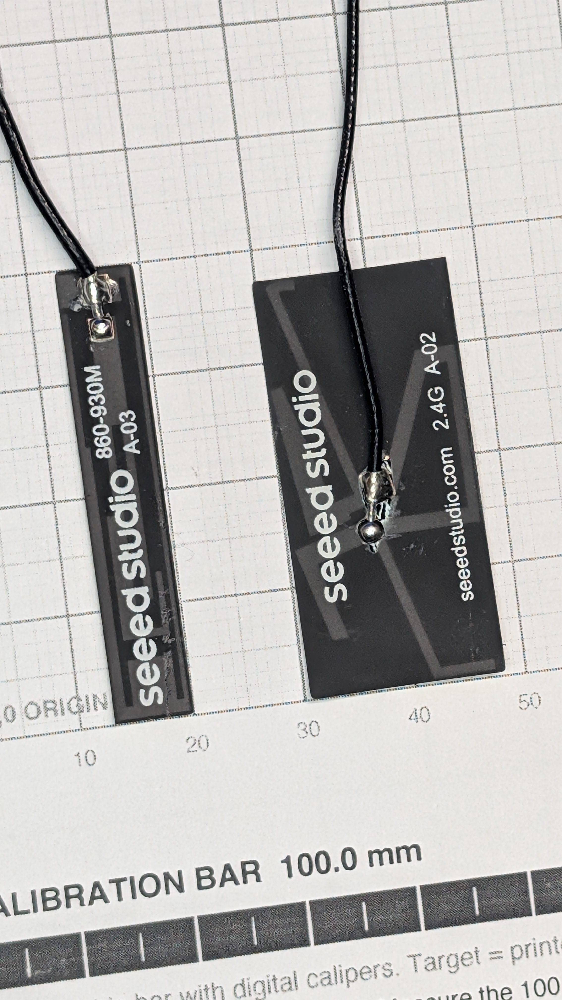

# Antennas

__Both leave via U.FL on the modules themselves__, so __no RF crosses the carrier at all__. That is what makes the carrier a purely digital and power board, and the layout tractable.

__Both mount on the ElectronicsSled, not the carrier__ (operator, 2026-09-11). Where on the sled is [js-rocket#99](https://github.com/jwilleke/js-rocket/issues/99)'s.

## The two

| | Where | Rule |
|---|---|---|
| __LoRa, `860-930M A-03`__ — a flat flexible-PCB strip ≈40 × 10 mm on an ~82 mm U.FL lead, __not a wire whip__ | U.FL on the Wio-SX1262, the strip run __aft__ along the sled | ≥50 mm from the GNSS antenna |
| __GNSS antenna__ — the active patch on its own small board, ≈25 × 25 × 8.3 mm, on a 100 mm U.FL lead. __Not the [L76K module](../L76K-GNSS/L76K-GNSS.md)__, which is the receiver it plugs into | In a __cradle at the ElectronicsSled's forward end, forward of the battery, face toward the nose tip__ | Nothing metal in front of its face |

A GNSS patch needs a __30–40 mm ground plane__ and a 24 mm board never will be — which is why the antenna is off-board rather than on the carrier.

## Mounting the GNSS antenna

__It and the battery are the two heaviest single things in the nose__ (masses in [BOM.md](../../docs/BOM.md)), so it is held, not stuck. Its documented home was the forward disc's face, and that is where the battery overhangs past the sled's forward end ([payload-sled.md](https://github.com/jwilleke/js-rocket/blob/main/docs/3d-printed-parts/payload-sled.md#where-the-cell-goes)). So the sled carries a __cradle forward of the battery__:

- __A back wall__ between battery and antenna takes boost. __Arms at the edge midpoints__, not the corners, locate it. __A lip or a nylon tie wrap over the front__ retains it against ejection and landing
- __Nothing metal in front of its face.__ Nylon over the front is fine. The nose's plastic is all that should lie between the antenna and the sky
- __The battery behind it is acceptable__, because it is on the antenna's ground side, not in front. Metal behind a patch reads as more ground; metal in front blocks it. Keep the back wall between them, and __run both leads aft along the sled__, never around the front
- __The nose taper is what makes it tight__: the antenna's corners have under a millimetre of clearance there. The numbers, and whether the battery can still move forward, are in js-rocket#99
- __Prove it on the bench__: [#6](https://github.com/jwilleke/js-rocket-avionics/issues/6)'s outdoor fix and time-to-first-fix, taken __with the battery behind the antenna__

## The LoRa antenna is a flat strip, not a whip

__`seeed studio 860-930M A-03` — a printed antenna on a thin flexible substrate, roughly 40 × 10 mm, on an ~82 mm U.FL lead.__ The 82 mm is the lead, not the radiator.

__A flat strip has to lie against something__, and that surface must be non-conductive and clear of the GNSS antenna. With the GNSS antenna at the sled's forward end, the strip goes __aft__: the lead leaves the Wio-SX1262 at nose z ~45 and reaches back along the sled, well over 50 mm from the forward cradle. It is also far less likely to foul the payload bore than anything stood up the ogive.

The other strip in the photograph, __`seeed studio 2.4G A-02`__ (~37 × 23 mm), is the XIAO's WiFi/BLE antenna and __does not fly__.

## The one hard rule: ≥50 mm apart

__915 MHz TX desenses a 1575 MHz GNSS front end by broadband noise, not harmonics__ — 2 × 915 = 1830 MHz, comfortably clear of GPS — so this is not a problem a filter solves. Separation is the mitigation, and [design.md](../../docs/design.md) is candid that desense __*"cannot be reasoned away on paper"*__: the bench is the proof.

The separation must survive __placement and cable routing__. Both antennas are on the sled, so it constrains the sled ([js-rocket#99](https://github.com/jwilleke/js-rocket/issues/99)) and the lead runs, not the carrier's layout.

## Does not fly

The kit's __2.4G A-02 antenna__ — the XIAO's WiFi/BLE antenna — is in the box and is not part of the flight build. The XIAOs have no antenna on the board itself, so without it Wi-Fi and Bluetooth have essentially no range, which suits a design that runs with Wi-Fi off.

---

Part numbers, vendors and masses live in [BOM.md](../../docs/BOM.md), which is the single source of truth for both. Purchase history is in [shopping-list.md](../../docs/shopping-list.md); the reasoning is in [design.md](../../docs/design.md).
