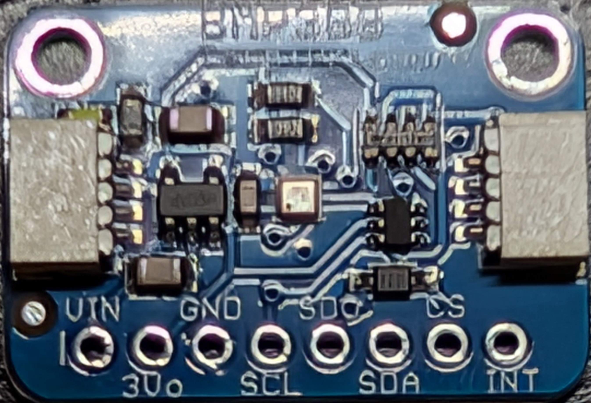
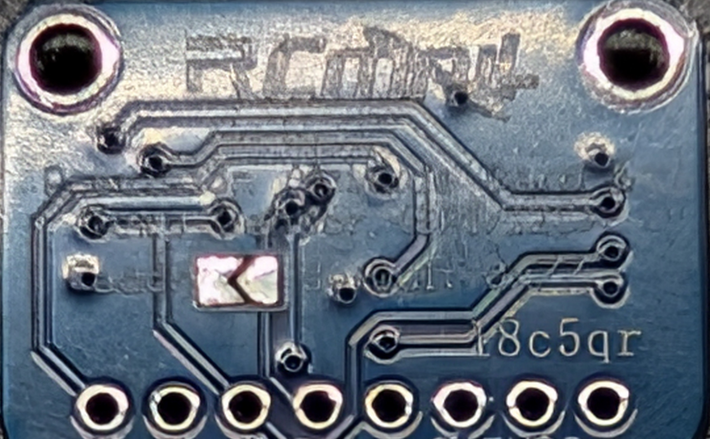
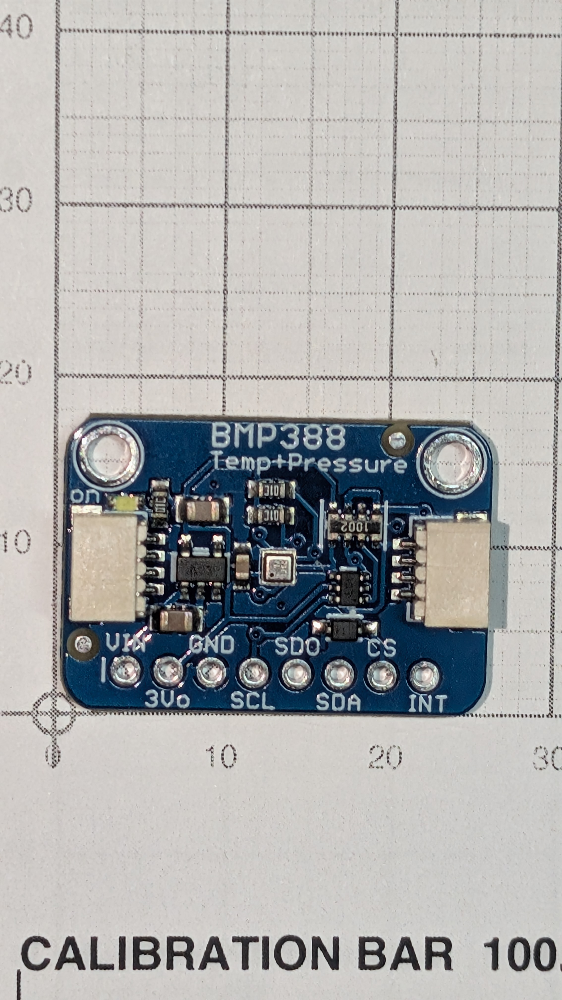

# BMP388 — barometer

__The only module measured off the part.__ Unported, and deliberately demoted.

## What it is for

Not the altimeter. With the static port dropped, its jobs are __timestamping the ejection event and detecting landing__.

__The port was dropped for five reasons__, of which [design.md](../../docs/design.md) calls the last decisive:

1. __No legal location__ — ports want a straight section ≥1 caliber clear of any transition; the longest run above the sled is __0.33 cal__
2. __Cannot be built__ — extending the body to a full caliber costs +38 mm against 15.9 mm of build headroom, and 3:1 fineness breaks
3. __Unrepeatable__ — hand-drilled into a part with no generator that takes 2 h 48 m to print
4. __Drags a pressure bulkhead in with it__ — a new part and a new failure mode
5. __Nothing consumes the number.__ No pyro channels; ejection is the motor delay. Apogee is data, not deployment

A __contamination bulkhead__ — foam or plate, no sealing duty — still belongs at the sled base to keep black-powder particulate off the boards.

Because it is not the altimeter, __the part is interchangeable__: it shares the BMP3xx driver so it was a drop-in for the out-of-stock BMP390, and a generic BMP280 would serve.

## Photographs

| [Front](BMP388-front.jpg) | [Back](BMP388-back.jpg) | [On the grid](BMP388-front-grid.jpg) |
|---|---|---|
|  |  |  |

__The grid shot is the dimensional record__ — board flat, square-on, calibration bar in frame, header row along the bottom and both mounting holes at the top corners. Measure it rather than the part; see [module-pinouts.md](../../docs/module-pinouts.md#how-these-are-measured--photograph-on-the-grid-not-calipers).

Pin order is legible on the front silkscreen; both Qwiic connectors sit on the short edges and both mounting holes on the long edge __opposite__ the header. The board is a blue clone, not an Adafruit black one.

## Pinout

Eight pins, __2.54 mm pitch__ (0.1 in), single row along one long edge, labels alternating above and below:

| Pin | 1 | 2 | 3 | 4 | 5 | 6 | 7 | 8 |
|---|---|---|---|---|---|---|---|---|
| | __VIN__ | 3Vo | __GND__ | __SCL__ | SDO | __SDA__ | CS | INT |

__Four are used: 1, 3, 4, 6__ — VIN, GND, SCL, SDA. Address __0x77__, no clash with the IMU.

## Four traps, all documented before bring-up

- __CS must be HIGH to select I2C.__ CS low puts a BMP3xx into SPI mode. If it does not enumerate at 0x77, __check CS first__ — it is the most likely cause
- __SDO selects the address, it is not data.__ High = 0x77 (default, jumper open), low = 0x76
- __Power to VIN, never 3Vo.__ 3Vo is the on-board regulator's *output*; back-feeding it kills the LDO
- __Ignore the seller's wiring diagram.__ It is SPI — SCL/SDO/SDA/CS to Arduino 13/12/11/10, the hardware SPI pins — and following it wastes a bench session

## Dimensions

| Thickness over Qwiic connectors | __4.79 mm__ | 4.4 (Adafruit) | +0.4 |
| Mounting-hole diameter | __Ø2.35 mm__ | 2.5 (Adafruit) | __undersize__ |
| Mounting-hole spacing | __20.58 mm__ | — | now known |
| Qwiic cables supplied | 2 × 110 mm | "two included" | — |
| Header row → near long edge | __2.54 mm__ | — | measured 2026-09-06 |
| Mounting holes → far long edge | __14.65 mm__ | — | measured 2026-09-06 |
| Mounting holes → each short side | __2.54 mm__ | — | measured 2026-09-06 |

__Every outline figure above is identical on the LSM6DSO32.__ Working in [module-pinouts.md](../../docs/module-pinouts.md).

__Mounting: flat, on a straight kit-standard header, no screws through the carrier__ (operator, 2026-09-11). The pin row is soldered on one edge. The free edge rests on __two M2 bolts through its own mounting holes, heads down__ on the carrier, nutted on top, which keeps it level at the header's ~2.50 mm. Nothing is screwed through the carrier. On the carrier it sits on the __low side, lengthwise__, standing ~1 mm proud on its pins with the header plastic up against the part ([PCB-carrier.md](../PCB-carrier/PCB-carrier.md)). The legs then need that extra millimetre too. __Straight, not right-angle__, and the same part on the bench and in flight, so it is soldered once and never removed. Settled in [module-pinouts.md](../../docs/module-pinouts.md#the-header-is-a-straight-kit-standard-strip--settled-2026-09-08), which owns it.

__All eight pads get soldered, four carry signal__ — `VIN` (1), `GND` (3), `SCL` (4), `SDA` (6). The rest are mechanical. __`CS` is tied to +3V3 on the carrier__, forcing I2C whatever the part's own pull-up does ([#19](https://github.com/jwilleke/js-rocket-avionics/issues/19)).

__The leg bolts are M2__ because the holes decide it: Ø2.35 passes an M2 with 0.35 mm of total clearance, and __an M2.5 does not fit at all__. See [Fasteners](../README.md#fasteners).

__The board is marked 3 V__, and the design runs +3V3 into VIN. __5 V is not a documented fallback for this board__, whatever the listing says.

---

Part numbers, vendors and masses live in [BOM.md](../../docs/BOM.md), which is the single source of truth for both. Purchase history is in [shopping-list.md](../../docs/shopping-list.md); the reasoning is in [design.md](../../docs/design.md).

