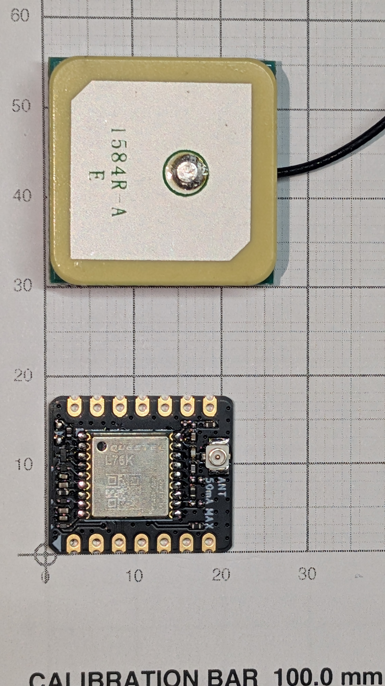

# L76K GNSS

__Position for XIAO-ESP32S3-lora.__ Plugs onto the XIAO's own 14 pads rather than presenting a header to the carrier, and ships with an active antenna.

## Specification

| | |
|---|---|
| Module | ≈__20 × 17 mm__, `QUECTEL L76K` |
| Interface | UART on __D6/D7__ |
| Mounting | onto the XIAO's own 14 pads — __no carrier footprint__ |
| Antenna | active patch, ≈__25 × 25 mm__, U.FL, __`ANT 50mA MAX`__ |

Why this module rather than a MAX-M10S is in [design.md](../docs/design.md#the-gps-is-an-l76k-not-a-max-m10s).

## Photograph, on the grid

Read off the grid — [module-pinouts.md](../docs/module-pinouts.md#how-these-are-measured--photograph-on-the-grid-not-calipers):

| | Size |
|---|---|
| __L76K module__ | ≈ __20 × 17 mm__ |
| __Patch antenna__ | ≈ __25 × 25 mm__, on a flying U.FL lead |

Silkscreen: `QUECTEL L76K`, a U.FL connector, and __`ANT 50mA MAX`__ — the active antenna's current budget. Exact outline barely matters, because __the module needs no carrier footprint at all__.

## The antenna is the part worth looking at

> __The patch is ≈25 mm square — wider than the 24 mm carrier__, and it is the only part of this module that has to be placed rather than stacked. It is fine in a 40 mm bore, but it lands at the sled's forward end facing up, where it competes for the same space as the ballast.

__It is also the obvious candidate for the module's mass overrun.__ A 25 mm ceramic patch on a coax lead is not a rounding error against a ≈20 × 17 mm board. [BOM.md](../docs/BOM.md) carries the open action: __weigh the module without its active antenna__. If the patch is most of the mass, the antenna is a separable choice.

## It needs no carrier footprint

Because it rides the XIAO stack, `GPS_TX`/`GPS_RX` stay in the netlist — the same node the module meets in the stack — but __nothing is placed for them__.

> __That moves the risk from layout to stack height.__ Whether the L76K clears the Wio-SX1262 on the B2B is open, against the __11.76 mm of spare__ [design.md](../docs/design.md) computes — and the L76K is not inside the 9.32 mm that figure is built on, which is the XIAO and the radio only. __If it cannot ride the stack it comes back to the carrier as a footprint__, needing ~21 mm the 95 mm board has. [design.md](../docs/design.md) says settle it at the breadboard stage — [#6](https://github.com/jwilleke/js-rocket-avionics/issues/6).

## Antenna

__Active patch on U.FL__, at the sled's forward end, __facing up__, satisfying the "no metal above the patch" rule. Keep it __≥50 mm__ from the LoRa whip — see [Antennas.md](Antennas.md).

## The mass problem

__This module is the entire nose-mass overrun.__ It was specced light and weighs far more — heavier than the battery, and larger than the next two BOM rows combined. Four other parts came in under estimate and still did not cover it. Figures are in [BOM.md](../docs/BOM.md), which owns them.

__Open action, from [BOM.md](../docs/BOM.md): weigh it without its active antenna.__ If the antenna is most of the mass this is a separable choice; if it is not, the part was mis-specced roughly threefold.

---

Part numbers, vendors and masses live in [BOM.md](../docs/BOM.md), which is the single source of truth for both. Purchase history is in [shopping-list.md](../docs/shopping-list.md); the reasoning is in [design.md](../docs/design.md).
