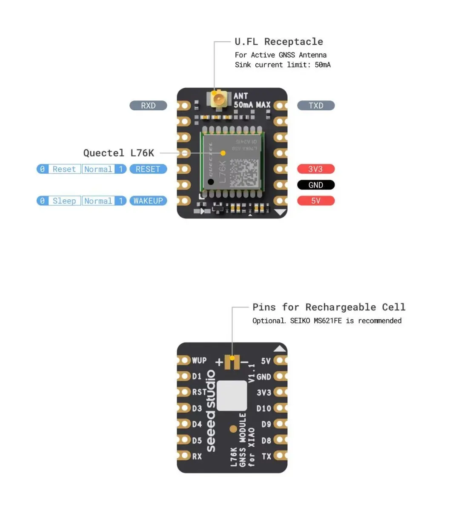

# L76K GNSS

The L76K GNSS Module offers global tracking through GPS, BeiDou, GLONASS, and QZSS. Designed for the Seeed Studio XIAO series module with a compact form and low power consumption, it's perfect for asset tracking and robotics.

__Position for XIAO-ESP32S3-lora.__ Ships with an active antenna. __It mounts flat on the carrier, on its own footprint__ (operator, 2026-09-09) — it *can* plug onto a XIAO-ESP32S3-x's own 14 pads, and that is how it was planned until the stack was looked at.

## Specification

| | |
|---|---|
| Module | ≈__20 × 17 mm__, `QUECTEL L76K` |
| Interface | UART on __D6/D7__ |
| Mounting | __flat on the carrier, own footprint__ — top face, ~21 mm |
| Antenna | active patch, ≈__25 × 25 mm__, U.FL, __`ANT 50mA MAX`__ |

- [Getting Started with L76K GNSS Module for SeeedStudio XIAO](https://wiki.seeedstudio.com/get_start_l76k_gnss/)

Why this module rather than a MAX-M10S is in [design.md](../../docs/design.md#the-gps-is-an-l76k-not-a-max-m10s).

## Photograph, on the grid

Read off the grid — [module-pinouts.md](../../docs/module-pinouts.md#how-these-are-measured--photograph-on-the-grid-not-calipers):

| | Size |
|---|---|
| __L76K module__ | ≈ __20 × 17 mm__ |
| __Patch antenna__ | ≈ __25 × 25 mm__, on a flying U.FL lead |

Silkscreen: `QUECTEL L76K`, a U.FL connector, and __`ANT 50mA MAX`__ — the active antenna's current budget. __The outline now matters__, because the module takes a footprint: ~20 × 17 mm against the top face's free 74 mm.

## The antenna is the part worth looking at

> __The patch is ≈25 mm square — wider than the 24 mm carrier__, and it is the only part of this module that has to be placed rather than stacked. It is fine in a 40 mm bore, but it lands at the sled's forward end facing up, where it competes for the same space as the ballast.

__It is also the obvious candidate for the module's mass overrun.__ A 25 mm ceramic patch on a coax lead is not a rounding error against a ≈20 × 17 mm board. [BOM.md](../../docs/BOM.md) carries the open action: __weigh the module without its active antenna__. If the patch is most of the mass, the antenna is a separable choice.

## Pinout — from Seeed's schematic, not the listing

__The 14 pads are the XIAO's own pattern__, two rows of 7, and Seeed labels each one by the XIAO pin it meets. So a position is named by its XIAO pin. Seeed's [schematic](https://files.seeedstudio.com/wiki/Seeeduino-XIAO-Expansion-Board/GPS_Module/L76K/109100021-L76K-GNSS-Module-for-Seeed-Studio-XIAO-Schematic.pdf) (V1.0, sheets 2–3) says what is behind each:

| Position | On the module | Wired in this design |
|---|---|---|
| __D6__ | `GPS_RXD`, 100 Ω to the L76K's RXD. __The module listens here__ | __yes__, from XIAO-ESP32S3-lora `D6`, the carrier's `GPS_TX` |
| __D7__ | `GPS_TXD`, 100 Ω to the L76K's TXD. __The module talks here__ | __yes__, to XIAO-ESP32S3-lora `D7`, the carrier's `GPS_RX` |
| __3V3__ | `VDD_3V3`, which feeds the L76K's VCC, the backup rail and the active antenna | __yes__ |
| __GND__ | ground | __yes__ |
| 5V | __connects to nothing__ on the module | no |
| D0 | `WAKEUP`, active low, pulled up on the module behind a diode | no, leave open |
| D10 (V1.0) / D2 (V1.1) | `RESET`, active low, pulled up on the module behind a diode | no, leave open |
| the rest | no connection on the module | no |

- __It runs on the battery.__ The module is powered from `3V3` alone, and `5V` is dead on battery power, so this matters. 41 mA tracking, with the active antenna (datasheet)
- __Wire by position, never by label.__ The carrier names its nets from the XIAO's side, so `GPS_TX` is the XIAO's transmit on `D6`. It lands on the pad Seeed labels __RX__. Following the labels crosses TX to TX
- __Four pads do the whole job__: D6, D7, 3V3 and GND. RESET and WAKEUP idle high without help, which is what the diodes are for: a host can pull them low, never drive them
- __The revision does not matter to this design.__ [Seeed's datasheet](109100021_L76K%20GNSS%20Module%20for%20Seeed%20Studio%20XIAO%20Datasheet.pdf) draws V1.0 and the picture above is V1.1. They differ only in where RESET sits, and RESET is not wired. The part's bottom silkscreen says which one is in hand
- __Face-up, it shows the pattern a XIAO shows from its back.__ Seeed's top view above matches the XIAO's underside reading in [module-pinouts.md](../../docs/module-pinouts.md#xiao-esp32s3--read-off-the-underside-2026-09-08). So flat on the carrier's top face it takes the __mirrored__ mapping, the one the bottom-face XIAO uses, not XIAO-ESP32S3-lora's. That is [#21](https://github.com/jwilleke/js-rocket-avionics/issues/21)'s trap in a new place, and it is an input to [#14](https://github.com/jwilleke/js-rocket-avionics/issues/14)

## Why it left the XIAO stack

> __Riding the stack traded a footprint for an unmeasured mechanical unknown, and the trade was reversed.__ Whether this module cleared the [Wio-SX1262](../Wio-SX1262-LoRa/Wio-SX1262-LoRa.md) on the B2B had never been tested — the parcels arrived weeks apart — and the arrangement put the GPS, the radio and the MCU in one cantilevered column on header pins. __Flat on the carrier deletes the question instead of answering it.__ The mechanical half of [#6](https://github.com/jwilleke/js-rocket-avionics/issues/6) is closed by that decision rather than by a measurement.

## Antenna

__Active patch on U.FL__, at the sled's forward end, __facing up__, satisfying the "no metal above the patch" rule. Keep it __≥50 mm__ from the LoRa whip — see [Antennas.md](../Antennas/Antennas.md).

## The mass problem

__This module is the entire nose-mass overrun.__ It was specced light and weighs far more — heavier than the battery, and larger than the next two BOM rows combined. Four other parts came in under estimate and still did not cover it. Figures are in [BOM.md](../../docs/BOM.md), which owns them.

__Open action, from [BOM.md](../../docs/BOM.md): weigh it without its active antenna.__ If the antenna is most of the mass this is a separable choice; if it is not, the part was mis-specced roughly threefold.

---

Part numbers, vendors and masses live in [BOM.md](../../docs/BOM.md), which is the single source of truth for both. Purchase history is in [shopping-list.md](../../docs/shopping-list.md); the reasoning is in [design.md](../../docs/design.md).
