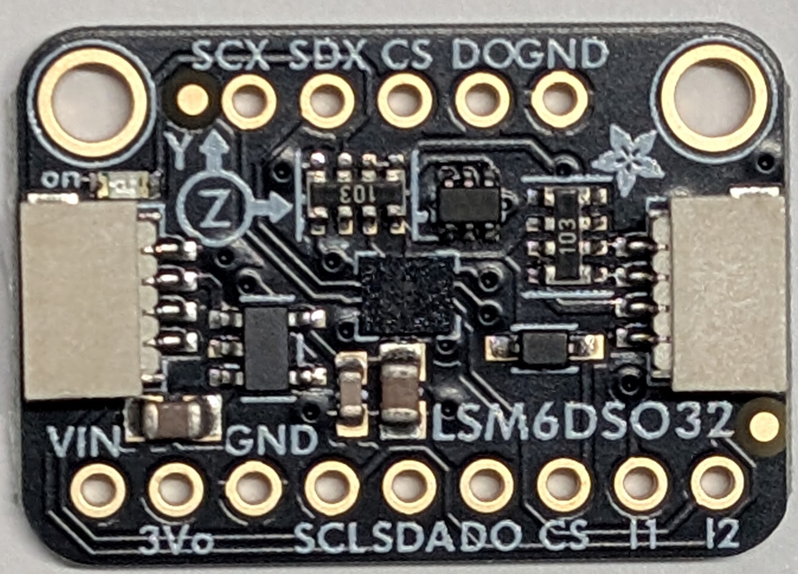
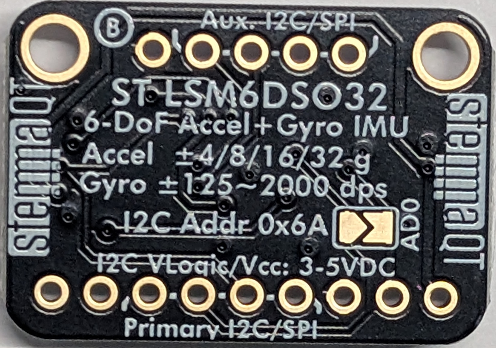

# LSM6DSO32 — 6-DoF IMU

__The apogee sensor.__ ±32 g accelerometer plus gyro, on a STEMMA QT breakout sharing the BMP388's layout.

## Why ±32 g, and why that reason is now stale

[design.md](../docs/design.md) selected this part against a __17.6 g boost peak__ — 32.90 N peak thrust over a 0.190 kg liftoff mass — on the argument that __±16 g parts clip during boost__ and a clipped boost integral destroys the velocity estimate for the whole flight. MPU6050, LSM6DS3, ICM-20948, ICM-42688-P and ADXL345 are all ±16 g and were all ruled out on it.

> __That 17.6 g figure describes a single-stage rocket, and flight 3 is two-stage.__ Against the weighed flight-3 masses the peak is __7.3–13.0 g__ depending on case. __Keep the part__ — it is bought, in hand, and the headroom costs nothing — but the stated reason no longer holds, and it is filed under constraints that must not be re-litigated, which is how a stale rule gets defended. Correcting it is [#12](https://github.com/jwilleke/js-rocket-avionics/issues/12).

## The FIFO is a hard requirement

__9 KB__, and [design.md](../docs/design.md) treats it as non-negotiable on any substitute: __do not poll at 500 Hz__. Batch-reading cuts ISR load, relieves the PSRAM path, and means a brief stall __queues samples in the sensor instead of losing them__.

__The gyro is not the apogee sensor.__ The accelerometer is. The gyro exists so body-frame acceleration can be rotated into the earth frame and gravity subtracted off the correct axis as the rocket tips over.

## Substitutes

| Part | Range | Gyro | Note |
|---|---|---|---|
| __BMI088__ | ±24 g | yes | Bosch, widely stocked, ~$12 |
| __MPU6050 + ADXL375__ | ±16 g + ±200 g | yes | One chip for coast and attitude, one for boost |
| __MPU6050 + H3LIS331DL__ | ±16 g + ±400 g | yes | Same split, more headroom |

The two-chip split is where this design began. __Reverting costs +1 g and one I2C address — no extra pins__, since everything shares the bus.

__Integrated 10DOF modules were evaluated and rejected.__ The DFRobot Gravity 10DOF is representative: its BMI323 maxes at ±16 g, it is 32 × 27 mm — wider than the carrier — uses a PH2.0 flying lead, and carries a magnetometer this design deliberately excludes.

## Mounting

__Flat, not perpendicular.__ Settled on the BMP388's measurements and it survives the form-factor surprise below: screws on the __Aux__ edge with the Primary header soldered opposite give __two-point restraint__ across the board, which is what boost loading wants and what a cantilevered header cannot offer. Flat also stacks low against the __19.7 mm__ available at the bore centre.

__Module footprint, not the bare chip.__ A bare LSM6DSO32 is an __LGA-14 at 2.5 × 3 mm__ and is not hand-solderable.

__Screw size is not known for this part.__ The BMP388's turned out to be __M2, not M2.5__, on holes published as 2.5 mm and measured at Ø2.35 — but that is a reading off a different board, and this one is unmeasured. Do not carry the figure across.

## Photographs — and the form factor is not what was assumed

| [Front](../docs/resources/LSM6DSO32-front.jpg) | [Back](../docs/resources/LSM6DSO32-back.jpg) |
|---|---|
|  |  |

__Read off the photographs, not off calipers.__ Dimensions are still owed — see Open below.

> __It does not share the BMP388's form factor.__ [module-pinouts.md](../docs/module-pinouts.md) expected it to: *"the LSM6DSO32 shares this form factor and is expected to match."* __It has two header rows, not one__, and __both mounting holes sit on the same edge as one of them__, where the BMP388's sit on the edge opposite its single row.

| | BMP388 | LSM6DSO32 |
|---|---|---|
| Header rows | __one__, 8 pins | __two__ — 9-pin `Primary I2C/SPI`, 5-pin `Aux. I2C/SPI` |
| Mounting holes | long edge __opposite__ the header | flanking the __Aux__ row, on that edge |

__The mounting conclusion survives the surprise.__ Screws on the Aux edge and the Primary header soldered on the opposite edge still gives __two-point restraint across the board__, which is what [module-pinouts.md](../docs/module-pinouts.md) wanted from flat mounting. The premise was wrong; the answer is unchanged.

### What the silkscreen says

__Primary row, 9 pins:__ `VIN 3Vo GND SCL SDA DO CS I1 I2`, labels alternating above and below the row.

__Aux row, 5 pins:__ `SCX SDX CS DO GND`. Exact ordering wants confirming with the part in hand rather than off a photograph.

Back silkscreen, all of it useful:

- __`ST LSM6DSO32`, `6-DoF Accel+Gyro IMU`__ — the *"confirm the silicon matches the label"* check at the foot of [module-pinouts.md](../docs/module-pinouts.md) __passes__
- __`Accel ±4/8/16/32 g`__ — ±32 g confirmed on the part, not on a listing
- `Gyro ±125~2000 dps`
- __`I2C Addr 0x6A`__ with an `AD0` solder jumper — __no clash with the BMP388's 0x77__, confirming from the part what [design.md](../docs/design.md) claimed from datasheets
- __`I2C VLogic/Vcc: 3-5VDC`__ — worth noting, because that exact wording is what *"did not survive the part arriving"* on the BMP388, whose board turned out to be marked 3 V. __Here it really is on the part__
- STEMMA QT on both short edges; board marked revision __B__

## Open — this part is the bottleneck

__It has been in hand since 2026-08-10 and has never been measured.__ [module-pinouts.md](../docs/module-pinouts.md) names it as *"the last unknown blocking sensor footprints"*, and the carrier has sat at stage 2c ever since.

__Do not assume it matches the BMP388.__ It is expected to share the form factor, but the BMP388 disagreed with its own datasheet in two places — Ø2.35 mm holes against a published 2.5, so __an M2.5 screw does not fit__, and 4.79 mm thick against 4.4.

Measuring it is [#5](https://github.com/jwilleke/js-rocket-avionics/issues/5): header pin order, hole diameter and spacing, board length and width, thickness over the Qwiic connectors, and confirmation that the silicon matches the label.

---

Part numbers, vendors and masses live in [BOM.md](../docs/BOM.md), which is the single source of truth for both. Purchase history is in [shopping-list.md](../docs/shopping-list.md); the reasoning is in [design.md](../docs/design.md).
