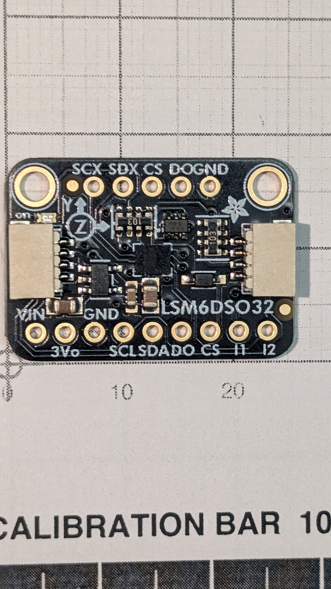

# LSM6DSO32 — 6-DoF IMU

__The apogee sensor.__ ±32 g accelerometer plus gyro, on a STEMMA QT breakout sharing the BMP388's layout.

## Specification

| | |
|---|---|
| Accelerometer | __±4 / 8 / 16 / 32 g__ |
| Gyroscope | ±125–2000 dps |
| FIFO | __9 KB__ |
| I2C address | __0x6A__, `AD0` solder jumper — no clash with the BMP388's 0x77 |
| Logic | 3–5 VDC, run at +3V3 |
| Package | STEMMA QT breakout. The bare part is an __LGA-14 at 2.5 × 3 mm__ and is not hand-solderable |

__Use the FIFO; do not poll at 500 Hz.__ Batch-reading cuts ISR load, relieves the PSRAM path, and means a brief stall __queues samples in the sensor instead of losing them__. Treat a FIFO as a hard requirement on any substitute.

__The gyro is not the apogee sensor.__ The accelerometer is. The gyro exists so body-frame acceleration can be rotated into the earth frame and gravity subtracted off the correct axis as the rocket tips over.

Why this part rather than another, and the ±16 g parts it rules out, is in [design.md](../../docs/design.md#sensor-rationale).

## On the bench

__2026-09-12__, on [XIAO-ESP32S3-cam](../XIAO-ESP32S3-cam/XIAO-ESP32S3-cam.md#on-the-bench), by [`bringup-cam`](../../firmware/bringup-cam/) ([#7](https://github.com/jwilleke/js-rocket-avionics/issues/7)):

| | Read | Means |
|---|---|---|
| Address, `WHO_AM_I` | `0x6A`, `0x6C` | the LSM6DSO32, answering with `CS` unconnected — the breakout holds it high ([#19](https://github.com/jwilleke/js-rocket-avionics/issues/19)) |
| `CTRL1_XL` | `0x74` | 833 Hz, `FS = 01` — __±32 g on this part__, where `11` would be ±16 |
| At rest, flat | 0.04, −0.05, __1.02 g__ | 1 g on Z: the scale is right |
| FIFO | 81 words in 100 ms | 833 Hz batching into the FIFO, continuous mode |

Its power LED is __green__.

## Mounting

__Flat, not perpendicular, and held by both its pin rows — no screws__ (operator, 2026-09-11). The Primary row is soldered on one edge and the __Aux row on the other__, which gives __two-point restraint__ across the board: what boost loading wants, and what a cantilevered header cannot offer. The part is too light to need more. On the carrier it sits on the __low side, lengthwise__, behind the L76K-GNSS ([PCB-carrier.md](../PCB-carrier/PCB-carrier.md)). Flat also stacks low against the __19.7 mm__ available at the bore centre.

__Straight kit-standard headers, not right-angle.__ The board stands ~1 mm proud of the carrier on both rows' pins, header plastic up against the part, so the plastic clears the solder joints of the modules on the carrier's other side. Same part on the bench and in flight — soldered once, never removed. Settled in [module-pinouts.md](../../docs/module-pinouts.md#the-header-is-a-straight-kit-standard-strip--settled-2026-09-08), which owns it.

__Four of the fourteen pads carry signal__ — `VIN`, `GND`, `SCL`, `SDA` on the Primary row. `DO`, `CS`, `I1`, `I2` and the whole 5-pin Aux row carry no signal — the Aux row is soldered for mechanical support only: no second sensor hangs off the auxiliary bus, and __no interrupt line exists anywhere in this design__, so the FIFO is read by polling rather than on `I1`. `CS` floating is fine — the breakout holds it high ([#19](https://github.com/jwilleke/js-rocket-avionics/issues/19), [on the bench](#on-the-bench)).

__Module footprint, not the bare chip.__ A bare LSM6DSO32 is an __LGA-14 at 2.5 × 3 mm__ and is not hand-solderable.

__The Aux row sits 12.70 mm (five pitches) from the Primary row__, centred over Primary pins 3–7 — measured off the photograph with the pin pitch as the ruler ([module-pinouts.md](../../docs/module-pinouts.md), which owns it). The mounting holes are unused.

## Form factor

| [Front](LSM6DSO32-front.jpg) | [Back](LSM6DSO32-back.jpg) |
|---|---|
|  |  |

The front shot is the dimensional record — square-on on the measurement grid, calibration bar in frame. __Measure the image, do not eyeball it__: [module-pinouts.md](../../docs/module-pinouts.md#how-these-are-measured--photograph-on-the-grid-not-calipers).

### Dimensions

| | |
|---|---|
| Outline | __25.5 × 17.8 mm__ |
| Mounting-hole spacing | __20.58 mm__ |
| Thickness over Qwiic connectors | __4.80 mm__ |
| Header pitch | __2.54 mm__ |
| Header row → near long edge | __2.54 mm__ |
| Mounting holes → far long edge | __14.65 mm__ |
| Mounting holes → each short side | __2.54 mm__ |
| Screw | __M2__ |

__The BMP388 is the same board dimensionally__ — same outline, same 20.58 mm centres, same thickness to 0.01. __The carrier carries one hole pattern, placed twice__: two M2 clearance holes at 20.58 mm centres. What differs is the rotation, not the drilling — the BMP388's holes are on the edge opposite its header, these are on the __Aux__ edge with the Primary row opposite.

### Fitting it

### What the silkscreen says

__Primary row, 9 pins:__ `VIN 3Vo GND SCL SDA DO CS I1 I2`, labels alternating above and below the row.

__Aux row, 5 pins:__ `SCX SDX CS DO GND`. Exact ordering wants confirming with the part in hand rather than off a photograph.

Back silkscreen, all of it useful:

- __`ST LSM6DSO32`, `6-DoF Accel+Gyro IMU`__ — the *"confirm the silicon matches the label"* check at the foot of [module-pinouts.md](../../docs/module-pinouts.md) __passes__
- __`Accel ±4/8/16/32 g`__ — ±32 g confirmed on the part, not on a listing
- `Gyro ±125~2000 dps`
- __`I2C Addr 0x6A`__ with an `AD0` solder jumper — __no clash with the BMP388's 0x77__, confirming from the part what [design.md](../../docs/design.md) claimed from datasheets
- __`I2C VLogic/Vcc: 3-5VDC`__ — worth noting, because that exact wording is what *"did not survive the part arriving"* on the BMP388, whose board turned out to be marked 3 V. __Here it really is on the part__
- STEMMA QT on both short edges; board marked revision __B__

---

Part numbers, vendors and masses live in [BOM.md](../../docs/BOM.md), which is the single source of truth for both. Purchase history is in [shopping-list.md](../../docs/shopping-list.md); the reasoning is in [design.md](../../docs/design.md).
