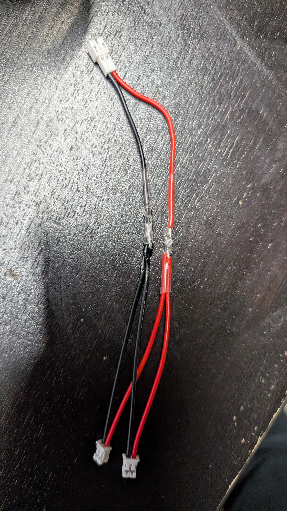

# LiPo battery

__One battery feeds both MCUs.__ ~300 mA average at full load, measured by voltage and time — ~100 minutes from full ([#8](https://github.com/jwilleke/js-rocket-avionics/issues/8)).

## The part

| | |
|---|---|
| Body | __29 × 36 × 4.75 mm__ — verified against the part, 2026-09-07 |
| Mass | __10.9 g__ with its pigtail — weighed. Adafruit's label says 10.5 |
| Leads | __80 mm__ measured, JST-PH. Adafruit's page says 102 — __the 80 is what governs__ |
| Output | 500 mAh at 3.7 V nominal |
| Vendor | [Adafruit 1578](https://www.adafruit.com/product/1578) |

__It is the largest single object in the nose__, and until 2026-09-07 this page recorded no dimension at all, so nothing about packaging could be settled.

### Reading the charge with a meter

__Neither XIAO can tell you__ — `BAT+`/`BAT−` are bare pads with no divider, and Meshtastic's battery figure is a placeholder. A multimeter across the battery's plug can.

__Measure it resting:__ unplugged from everything for at least a minute. Charging pushes the reading up and a load pulls it down, and a battery taken off a load keeps creeping back up for an hour or so.

| Resting voltage | Roughly | |
|---|---|---|
| __4.20 V__ | __full__ | the charger's limit. Its light goes out here |
| 4.05 V | ~85% | |
| 3.95 V | ~75% | where the #8 run started |
| 3.80 V | ~50% | __store it here__ if it will sit for weeks — a LiPo ages fastest held full |
| 3.70 V | ~30% | the "3.7 V" on the label is the average over a discharge, not a charge level |
| 3.60 V | ~15% | |
| 3.50 V | ~5% | where the #8 run ended, after 67 minutes at full load |
| below 3.4 V | empty | recharge now |
| __3.0 V__ | __never go below__ | a LiPo taken deeply flat may not come back |

__Approximate__ — the curve varies with the battery, its age and temperature, and it is flattest in the middle, so a 0.05 V difference there is a lot of charge. Read the ends of the table with more confidence than the middle.

__Charging, measured on the bench__ (2026-09-12), through XIAO-ESP32S3-cam's USB with XIAO-ESP32S3-lora unplugged — an inline USB power meter on the cable:

| USB meter, 5.15 V | Current |
|---|---|
| XIAO-ESP32S3-cam + charging the battery | __~200 mA__ |
| XIAO-ESP32S3-cam alone, idle, battery unplugged | __~83 mA__ (0.081–0.086 A) |
| __So the charger puts in__ | __~115–120 mA__ — a little above Seeed's 100 mA for the Sense |

| Time | Resting voltage |
|---|---|
| 16:23 | 3.50 V — charging starts |
| 16:49 | 3.57 V |
| 17:32 | 3.64 V — ~15–20% |
| 18:43 | __3.83 V__ — ~55%, after ~2 h 20 min of charging: ~115 mA × 2.3 h ≈ 270 mAh, which fits |

__Empty to full is about 4.5 hours__ at that rate, the slow top-off included. With XIAO-ESP32S3-lora also drawing, it does not charge at all — so XIAO-ESP32S3-lora draws __more than ~115 mA__ ([Two chargers on one battery](#two-chargers-on-one-battery)).

__Measure the battery, not the pigtail.__ With the battery unplugged and USB in, the XIAO's BAT pigtail read __4.03 V__ — that is the charger idling with nothing to charge, looking for a battery (the same reason its light flashes), not a charge level.

### Where it goes — on the PayloadSled, forward of the carrier

__Decided__ (operator, 2026-09-07 and 2026-09-08). [`payload-sled.md`](https://github.com/jwilleke/js-rocket/blob/main/docs/3d-printed-parts/payload-sled.md#where-the-cell-goes) owns the placement and every number in it. In outline: flat on the sled's D-flat, resting on the forward disc, long axis along the sled, held by tie wraps, and sticking out past the sled's forward end into the nose taper. __It is forward of the carrier, not on it.__ Drawing: [Battery in the nose taper](https://github.com/jwilleke/js-rocket/blob/main/docs/designs/nose-battery-8548227.html).

What that decides on this side:

- __The JST goes toward the carrier's forward end.__ The lead leaves the battery's aft end, just forward of the carrier, so the 80 mm has slack to spare and the forward end keeps the run shortest. Placement is [#14](https://github.com/jwilleke/js-rocket-avionics/issues/14)'s
- __The battery is not reachable without pulling the sled.__ Changing it, or charging it on its own charger, means the M3 × 55 out and the sled pushed out of the nose ([#1](https://github.com/jwilleke/js-rocket-avionics/issues/1)). Charging on the carrier through USB __did not work__ with XIAO-ESP32S3-lora connected ([#8](https://github.com/jwilleke/js-rocket-avionics/issues/8)); the carrier's switch that takes it off the battery while USB is in ([#11](https://github.com/jwilleke/js-rocket-avionics/issues/11)) is what makes field charging work — see [Two chargers on one battery](#two-chargers-on-one-battery)
- __The tie wraps restrain it, never the JST__

## Distribution

The battery lands on a __JST-PH on the carrier__, toward its forward end, and short __soldered pigtails__ run to each XIAO's underside BAT pads. That indirection is forced, not chosen: __BAT+/BAT− are not on the castellated edge__, so the battery cannot reach a XIAO through the headers.

- __Solder the pigtails before the XIAO goes onto its headers.__ Not before the expansion board — that mates to the *front* face and never covers the pads. What covers them is the __carrier__, at the header's 2.50 mm, and the breadboard does the same on the bench. Faces and evidence in [XIAO-ESP32S3-cam.md](../XIAO-ESP32S3-cam/XIAO-ESP32S3-cam.md#which-face-carries-what--settled-off-seeeds-two-drawings-and-the-stack-itself)
- __Both XIAO chargers sit in parallel on one battery — charge through one USB port at a time.__ This avoids adding a charge IC. It breaks a general rule on purpose, and one port at a time is necessary but not sufficient — see [Two chargers on one battery](#two-chargers-on-one-battery)
- __On battery power there is no voltage on the 5V pin__
- __Reversing a LiPo into a XIAO destroys it__ — [design.md](../../docs/design.md) requires the pigtail polarity be silkscreened. Seeed's wiki: __BAT− is the pad nearer the USB-C__
- __The battery is mechanically restrained, never hangs off the JST.__ On the sled that is the tie wraps. __The JST is a connector, not a mount__

### On the bench — the join harness

__What the carrier's JST does in copper, this does on the bench__ (operator, 2026-09-12): one plug takes the battery, and two plugs take the XIAOs' pigtails. Each joint is under its own heat-shrink.

> __The battery's JST and the XIAO pigtails' JSTs are wired opposite ways.__ Mated as bought, red met black. The harness is built with its wires crossed to correct it, and was checked with a meter — 3.95 V at each XIAO plug, red positive. __This is the trap the carrier's owed check — JST pin 1 against the battery's red lead — exists for__ ([PCB-carrier-design.md](../PCB-carrier/PCB-carrier-design.md#checks-owed-before-building)): JST-PH housings do not fix a polarity, and two parts that both look right can disagree. Check with a meter, every new cable.

### Two chargers on one battery

__The general rule is: do not parallel two boards' BAT pads onto one pack, because each board has its own charger.__ This design breaks it deliberately. Both XIAOs' BAT pads are wired to the one battery, which saves a charge IC and the ~8 g of a second battery. So the rule is not "don't", it is __what has to hold for it to be safe__.

The charger is an __SGM40567-4.2__ on each XIAO, a linear charger with a 4.2 V limit. Seeed's wiki gives __50 mA fast / 3.8 mA trickle__ for the plain XIAO ESP32S3 and __100 mA / 0.9 mA__ for the Sense. These are unverified here: the part number is from Seeed's forum, not read off the schematic.

__Both USB ports at once is the case the rule exists for.__ Two chargers push into one battery, and each one sees only its own current, so neither knows the true state of the pack. The carrier keeps the two `5V` pins apart ([PCB-carrier.md](../PCB-carrier/PCB-carrier.md)), so one cable never switches on both chargers. Only a second cable does. __Never plug in both, on the bench or in the rocket.__

__One port at a time removes that fight. It does not make charging normal, because the other board keeps running.__ Charging through [XIAO-ESP32S3-cam](../XIAO-ESP32S3-cam/XIAO-ESP32S3-cam.md), as [PCB-carrier.md](../PCB-carrier/PCB-carrier.md#charge-through-the-sense-stack-and-only-that-one) decides, leaves XIAO-ESP32S3-lora powered from the battery. Its whole draw (ESP32-S3, Wio-SX1262, L76K) flows through the cam's charger along with the charge current. Three consequences:

- __Net charge may be near zero.__ The charger supplies ~100 mA in total. What reaches the battery is that minus XIAO-ESP32S3-lora's running draw, which has never been measured on its own. The [L76K](../L76K-GNSS/L76K-GNSS.md#pinout--from-seeeds-schematic-not-the-listing) alone is __41 mA__ by its datasheet, before the ESP32-S3 and the radio. Against a ~300 mA total for both boards, the lora side could take most of the 100 mA
- __The charger never terminates.__ It stops when its current falls below 0.9 mA, and XIAO-ESP32S3-lora's draw keeps it far above that. So the battery sits at 4.2 V for as long as the cable is in, and __the red LED never goes out__. The usual "charged" signal does not exist in this configuration
- __It cannot overcharge.__ The 4.2 V limit is the charger's own and still holds. So the failure is a battery that does not fill, or ages from sitting at 4.2 V. It is not a fire

__Measured, 2026-09-12 — it does not charge.__ No meter could go in series at the JSTs, so it was measured by resting voltage instead: XIAO-ESP32S3-cam on USB, both boards on the battery, XIAO-ESP32S3-lora running Meshtastic. Over __1 h 25 min the battery fell from 3.5 V to 3.4 V__ — XIAO-ESP32S3-lora's draw exceeds the ~100 mA the charger gives ([#8](https://github.com/jwilleke/js-rocket-avionics/issues/8)).

__Fixed in the carrier design, 2026-09-12__ ([#11](https://github.com/jwilleke/js-rocket-avionics/issues/11)): while USB is in XIAO-ESP32S3-cam, a MOSFET switches XIAO-ESP32S3-lora off the battery, so the charge goes in — [PCB-carrier-design.md](../PCB-carrier/PCB-carrier-design.md#xiao-esp32s3-lora-off-the-battery-while-usb-is-in--decided-not-yet-in-the-generator). That restores charging through the service pigtail. __Until the carrier exists, charge the battery on its own__ — unplugged from the JST, or through XIAO-ESP32S3-cam's USB with XIAO-ESP32S3-lora unplugged from the harness.

__A second trap found the same day: the JST joins both boards' BAT pads, so USB into either XIAO powers both.__ Unplugging one board's USB does not power it down while the other is plugged in — which is why the microSD, jammed by a reset mid-write, stayed jammed until both were out.

### The pigtail is the fragile part, and the solder joint must not be the anchor

__`BAT+`/`BAT−` are 2.3 × 1.3 mm pads.__ That is an electrical connection, not a structural one. If the joint is what holds the wire, boost and landing put the load into the pad, and __the pad lifts__ — taking the copper with it and leaving nothing to re-solder to.

So the wire is anchored to the board, and the joint carries current only:

- __28–30 AWG fine-stranded, silicone insulated. Never solid core.__ Solid wire work-hardens and snaps at exactly this kind of joint; stranded silicone stays flexible and takes vibration without transmitting it
- __Bond the wire to the PCB 3–5 mm from the pad__, with UV-cure or two-part epoxy. __This is the actual fix__ — everything else on this list is secondary to it. It puts the flex point in the free wire instead of on the copper
- __Leave a service loop.__ Slack, so nothing is ever in tension. A taut pigtail is a pigtail under load whenever anything moves
- __Dress it through the 2.50 mm gap__ between the XIAO's back face and the carrier — clear of the header pins, and not lying on carrier copper. Route and tack it __before__ the XIAO goes down; there is no access afterwards
- __Conformal coat over the finished joint__, after bench testing, with the rest of the board
- __Polarity silkscreened at the JST__ — reversing a LiPo into a XIAO destroys it

> __A broken pigtail is silent.__ With both `3V3` pins on the same plane, the surviving regulator back-feeds the dead module and the rocket still works — so the first failure hides the fault and only the second one grounds you. __Inspect both joints as a step, rather than waiting to be told about them.__ It is also the strongest argument for keeping the plane tie until [#8](https://github.com/jwilleke/js-rocket-avionics/issues/8) says otherwise.

__No connector at the pad end.__ A connector there would put mass and leverage on the weakest joint in the assembly, which is the opposite of what is wanted. The disconnect belongs at the far end and already exists — the JST.

## The known risk, observed: no brownout at bench load

[BOM.md](../../docs/BOM.md) accepts a coupling failure in writing: __*"a camera brownout on B can disturb A."*__ [design.md](../../docs/design.md) repeats it — separate batteries would isolate the boards but cost ~8 g the mass budget cannot afford.

__Measured on the bench, 2026-09-12 ([#8](https://github.com/jwilleke/js-rocket-avionics/issues/8)): neither board reset.__ Both boards on this battery through the join harness, XIAO-ESP32S3-cam running `soak-power` flat out — 82 925 capture-and-write cycles in __67 minutes__, 1.8 GB to the card — and XIAO-ESP32S3-lora transmitting a Range Test packet every 15 s. The battery went from __3.95 V to ~3.5 V resting__, nearly empty, which is the partly-discharged case this risk is about. XIAO-ESP32S3-cam's reset history and XIAO-ESP32S3-lora's uptime both show one unbroken run.

__Verdict: coupling acceptable at bench load; no decoupling added and no second battery.__ Repeat it on the carrier — its copper and shared ground differ from two breadboards and a harness — and once from a full charge to time the runtime.

__If decoupling is the answer it lands in the layout before the board is ordered__, not after.

## Rejected

__An 18650__ would put nose mass near the ~65 g weathercock limit.

---

Part numbers, vendors and masses live in [BOM.md](../../docs/BOM.md), which is the single source of truth for both. Purchase history is in [shopping-list.md](../../docs/shopping-list.md); the reasoning is in [design.md](../../docs/design.md).
