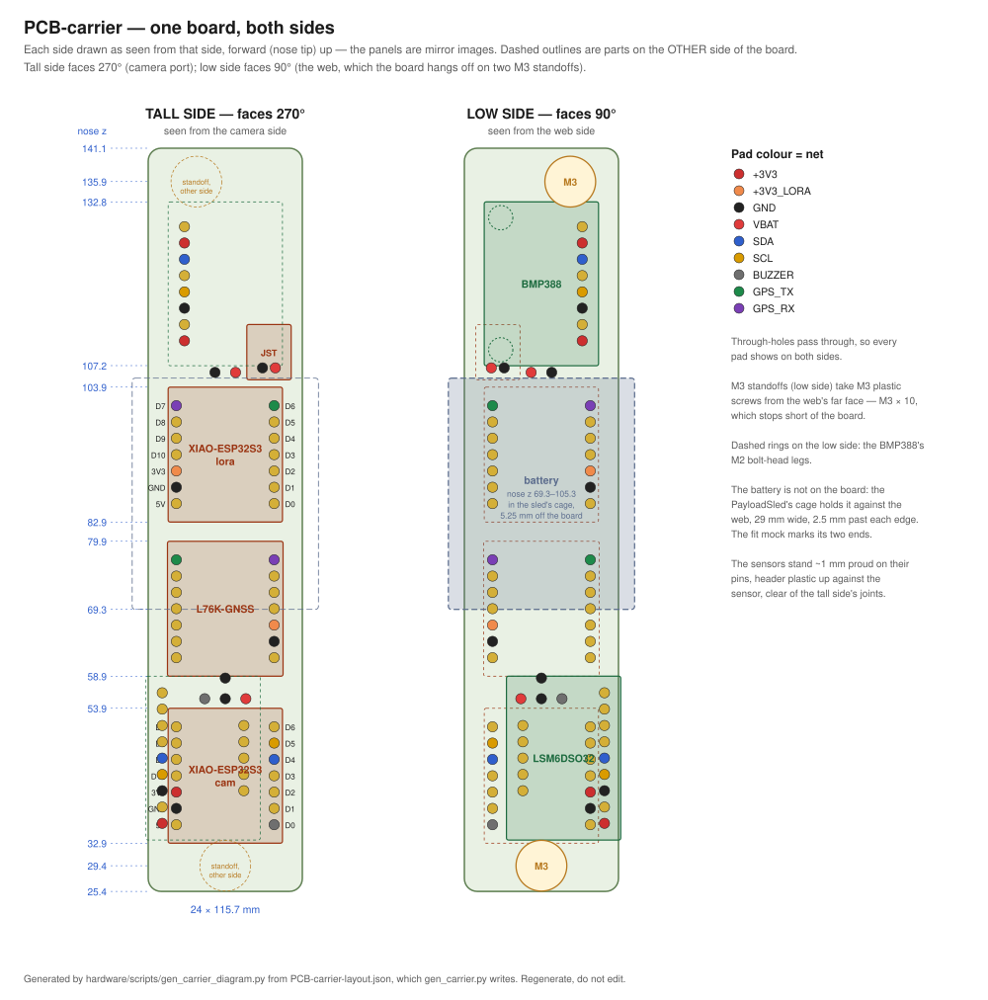

# PCB-carrier — design brief

__Status: adopted, operator 2026-09-11.__ This is the design record for the carrier; [PCB-carrier.md](PCB-carrier.md) is what the generated board is. It replaces the "two identical boards" layout, which was never the operator's decision and was recorded as one in error.

## What the operator asked for

- __One board__ — one physical PCB-carrier, not two
- __Both XIAO stacks on the same side of the board__, one at each end — the tall parts together
- __The web offset between the discs__, out of the board's way
- __Two screws__, for precise alignment, and the board __removable from the sled__ as one unit
- __The camera mounts on the bridge__
- __The GNSS antenna mounts on the ElectronicsSled__

## The design

__One two-sided board on the sled's centre line.__ The __tall side__ faces 270°, the camera port: XIAO-ESP32S3-cam aft, under the camera; the L76K-GNSS; XIAO-ESP32S3-lora forward; the JST. The __low side__ faces 90°, the web: the LSM6DSO32 and BMP388, and two standoffs. The web is moved toward 90°, clear of the low side, and the board hangs off it. Take out two screws and the whole board comes off the sled.

__Board: 24 × 90.4 mm, nose z 25.4 → 115.8, ~4.1 g.__ Station lists for both sides are in [PCB-carrier.md](PCB-carrier.md#layout).

### What makes it work

__1. Every part sits in its own holes, and no hole meets another across the two sides.__ The L76K-GNSS already has its pins soldered, so it takes its own footprint on the tall side between the two XIAOs. The sensors run __lengthwise__ on the low side, their pin rows 2.15 mm inboard of the tall-side modules' rows and parallel to them. Turned 90°, they would cross. `gen_carrier.py` checks every through-hole against every other on each run.

__2. The sensors stand ~1 mm proud on their pins__, header plastic up against the sensor, so the plastic clears the tall side's solder joints on the low face.

__3. The standoffs are soldered to the board and the screws come in from the web side.__ Würth WA-SMSI M3 standoffs, 10 mm, on the low side; two M3 plastic screws, M3 × 10, through the web into them. Nothing fastens through to the tall side, so __no screw head is ever under a module__. Neither standoff is under a module either: each has a 4.4 mm hole through the board, so standoff 1 sits at the aft end, under the USB-C plug room, clear of XIAO-ESP32S3-cam and the BAT pigtail beneath it (operator, 2026-09-11).

__4. The board does not touch the web.__ It hangs 10 mm off it, so there are no printed pads, no filed tails and no slots.

## Across the bore

Looking forward, 270° down; r from the sled's centre line.

| | r | Clearance |
|---|---|---|
| Board | −0.5 to +0.5 | on the centre line |
| Cam stack top | 11.2 toward 270° | __2.9 mm__ to the camera pad floor — as [#89](https://github.com/jwilleke/js-rocket/issues/89) was designed |
| Lora stack top | 12.3 toward 270° | ~5.6 mm to the bore at its corners |
| Sensors top | 8.8 toward 90° | 1.7 mm to the web |
| __Web__ | __10.5–13.5 toward 90°__ | 24 mm wide; the bore is 29.5 mm wide at r 13.5 |

__The bridge__ is unchanged in principle: its fins stand beside the board's edges and carry the camera pad over the cam stack. They now root on a web 12 mm further toward 90°, so they are longer.

## Electrically

__One regulator per load.__ XIAO-ESP32S3-cam feeds the +3V3 plane and the sensors; XIAO-ESP32S3-lora feeds only the L76K-GNSS, on its own net, off the plane. __One board means no battery link__ between boards: the JST feeds both XIAOs' BAT pigtail pads directly. The connection table is in the [README](../../README.md#connections).

## What changes in the sled — js-rocket#99

- __Web offset__ to r 10.5–13.5 toward 90° (its centre 12.0 mm off the axis), still 3 mm and one piece. The D-flat, discs and clocking loop do not move
- __Two M3 clearance holes__ through the web, at the standoffs: nose z 29.4 on the board's centre line, and nose z 110.6, 4.5 mm off it. Screws from the web's 90° face
- __Bridge fins__ reach from the moved web, past the board's edges, to the camera pad
- __Battery unmoved.__ The web edge it partly rests on moves 12 mm toward 90°, still under the battery but off its centre line — check its tie wraps
- __GNSS antenna cradle__ unchanged: with the battery unmoved it keeps ~0.9 mm at its corners in the taper
- __No pads, no slots, no board-to-web contact__

## Checks owed before building

1. __The standoff part__: Würth WA-SMSI M3, 10 mm (9774100360) — confirm it is stocked
2. __JST pin 1 against the battery's red lead__
3. __That stock Meshtastic reads the GPS on D6/D7__ — [#6](https://github.com/jwilleke/js-rocket-avionics/issues/6)'s bench check

Settled by the generator rather than owed: every sensor's pin order on the back of the board, and every hole's clearance across the two sides.

## How it got here

The first layout, one board with parts on both faces, was derived from a camera-port drawing that put the board and the sled's web in the same place. When that surfaced ([#13](https://github.com/jwilleke/js-rocket-avionics/issues/13)), the session wrongly turned the operator's "prefer one board" into two identical boards, one on each web face, and built on it. This design goes back to what was asked for: one board, the web moved out of its way, both stacks on one side.
