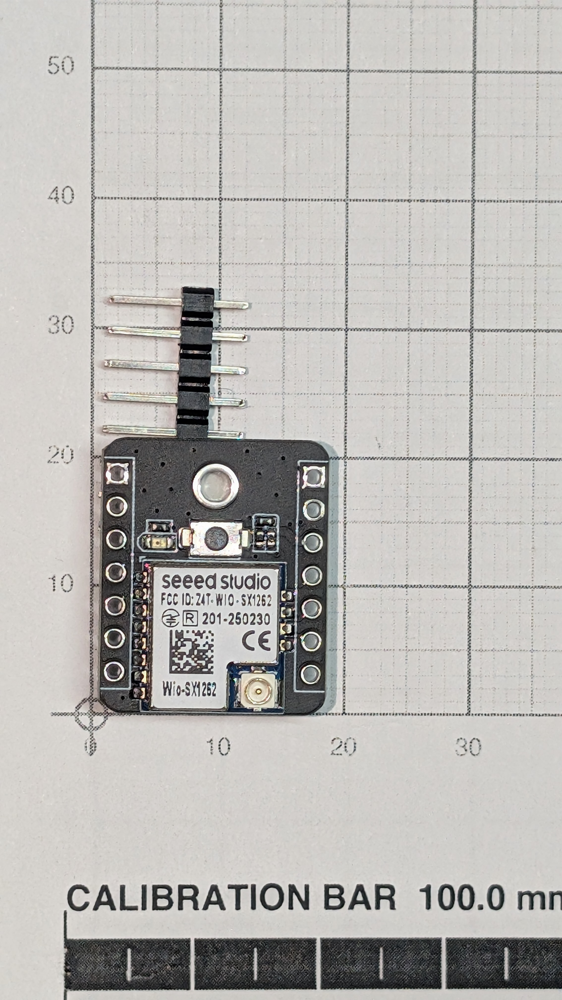

# Wio-SX1262 — LoRa radio

__The link that gets the rocket found.__ Sits on top of the plain XIAO in XIAO-ESP32S3-lora's stack and carries its own U.FL connector.

## What it is for

GPS position out over LoRa, on stock Meshtastic. No firmware is written for it, and that is deliberate — see [XIAO-ESP32S3-lora.md](../XIAO-ESP32S3-lora/XIAO-ESP32S3-lora.md).

## Buy it as the kit, never as two boards

[BOM.md](../../docs/BOM.md) is emphatic: __must be the matched B2B kit variant__ — buy the kit SKU, __never the two boards separately__. The kit is a supported Meshtastic device and __arrives pre-flashed__, which is the entire premise of XIAO-ESP32S3-lora. Bought separately, the radio ends up on non-standard pins and stock Meshtastic can no longer be flashed as a rescue.

## Meshtastic, as the kit delivered it

__Read off the board on 2026-09-11__, over USB with the Meshtastic command-line tool, reading only — nothing was changed. __Pre-flashed is confirmed__: the kit's XIAO runs stock Meshtastic. (The phone at first found nothing because the Wio-SX1262 had been mated to the other XIAO — [which XIAO is which](../XIAO-ESP32S3-lora/XIAO-ESP32S3-lora.md#which-xiao-is-this-one).)

| Setting | As delivered | What it means |
|---|---|---|
| Firmware | `2.7.15.567b8ea` | stock Meshtastic |
| Hardware model | `SEEED_XIAO_S3` | the build for this kit |
| Role | `CLIENT` | the default. Whether the flight node should be a tracker is [#23](https://github.com/jwilleke/js-rocket-avionics/issues/23)'s question |
| __LoRa region__ | __unset__ | __the radio stays off until it is set.__ Setting it to `US` is step 5 of [the bench page](../../docs/bench-work/lora-bench-board.md) — with the antenna on first |
| Bluetooth | on, __fixed PIN `123456`__ | the published default, so __anyone within Bluetooth range can pair with it__. Fine on the bench; a flight node should not keep it. A changed PIN is __not__ written in this repo |
| GPS mode | enabled | it looks for the GPS |
| GPS pins | `0` / `0` | __the firmware's built-in pins — which are D6/D7__, where the [L76K-GNSS](../L76K-GNSS/L76K-GNSS.md) is wired. Its startup log names GPIO43/44 and detects the L76K ([#6](https://github.com/jwilleke/js-rocket-avionics/issues/6#issuecomment-5639176943)) |

__To read them again__, with the board on USB — `--get` only reads; `--set` is what changes the board:

```sh
pip install meshtastic
meshtastic --device-metadata
meshtastic --get lora.region --get bluetooth --get position.gps_mode
```

__Do not run `meshtastic --info` into anything that gets saved.__ It prints the node's position once the GPS has a fix, and this repo is public.

## Photograph



Silkscreen: __`Wio-SX1262`, `FCC ID: Z4T-WIO-SX1262`__, CE and MIC marks. Outline is the XIAO's ~__17.5 × 21 mm__ with 14 castellated pads, 7 a side, and the __U.FL connector is on the module__.

> __A 2×5 header is currently fitted, standing off one edge.__ That is bench kit, not the flight fit: the flight connection is __two 1×7 strips, one down each long edge__ — see [Stacking-headers.md](../Stacking-headers/Stacking-headers.md), which owns the part and the standoff.
>
> __This line previously called for a "2×7, ~14 mm standoff" stack and both halves were wrong.__ There is no 2×7 part — the XIAO's rows are 17.0 mm apart, not 2.54, so a dual-row header never fits. And the ~14 mm standoff came from a retracted revision of [design.md](../../docs/design.md) that had the expansion board hanging *below* the XIAO; the kit's standard ~2.50 mm headers are the flight part and no tall stacking headers are needed.

## Interfaces

| | |
|---|---|
| Connection | __B2B__ on top of [XIAO-ESP32S3-lora](../XIAO-ESP32S3-lora/XIAO-ESP32S3-lora.md). The [L76K-GNSS](../L76K-GNSS/L76K-GNSS.md) is not in this stack; it has its own place on the carrier |
| Antenna | __U.FL on the module itself__ — the Seeed `860-930M A-03` strip. Which antenna and where it runs: [Antennas.md](../Antennas/Antennas.md) |
| Carrier | __Nothing.__ No footprint, no RF across the board |
| Height added to a XIAO | __4.79 mm__ — 9.32 mm for the pair against 4.53 bare |

__No RF crosses the carrier at all.__ Both antennas leave via U.FL on their own modules, which is what makes the carrier a purely digital and power board and the layout tractable.

## Things that will catch you

__Antenna separation is a design rule, not a preference: ≥50 mm__ between the LoRa antenna and the GNSS antenna. 915 MHz TX desenses a 1575 MHz front end __by broadband noise, not harmonics__ — 2 × 915 = 1830 MHz, clear of GPS — so the mechanism is not one a filter fixes. [design.md](../../docs/design.md) calls desense something that *"cannot be reasoned away on paper."*

---

Part numbers, vendors and masses live in [BOM.md](../../docs/BOM.md), which is the single source of truth for both. Purchase history is in [shopping-list.md](../../docs/shopping-list.md); the reasoning is in [design.md](../../docs/design.md).
