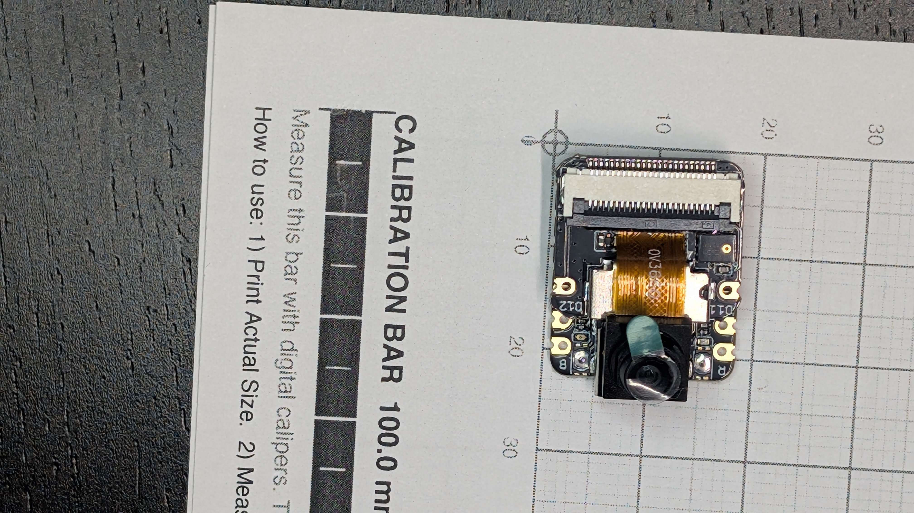
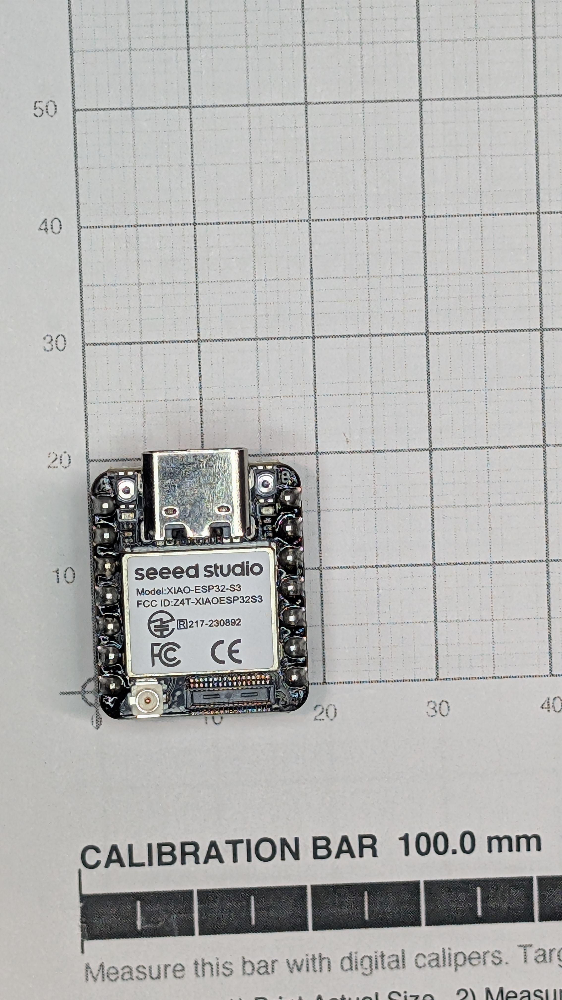
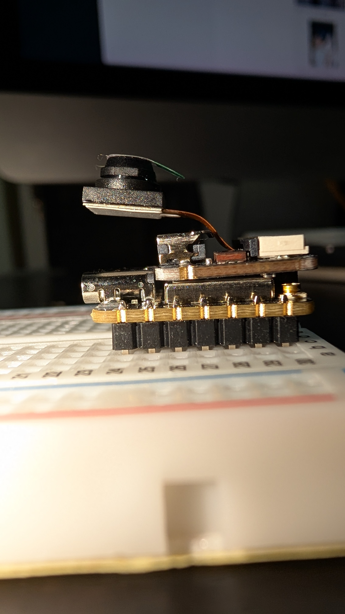

# XIAO ESP32S3 Sense — board B

__The flight recorder's MCU.__ Same module as board A plus the Sense expansion board, which carries the camera — an __OV3660__ — and the __microSD__ slot.

## What it is for

Board B does the work that cannot be bought pre-flashed: camera, IMU, barometer, PSRAM logging. Its firmware is __custom and not yet started__.

Splitting it from board A buys failure isolation, and dissolves two problems as a side effect ([design.md](../docs/design.md)): board B sheds LoRa and the GPS UART, so __an I2C GPIO expander is no longer needed__, and its SPI carries only the microSD, so __no "do not transmit while recording" scheduling rule is required__ — different MCU, different bus.

## Interfaces

| | |
|---|---|
| Carrier face | __Bottom__ — with LSM6DSO32, BMP388 and the buzzer |
| Position | __centred at carrier y = 18 mm__, which is what puts the camera at nose z 30..45 |
| Sensors | I2C on __D4/D5__ |
| Buzzer | PWM on __D0__ |
| Camera | __OV3660__ on a __DVP parallel bus__ — 14 GPIO plus I2C/SCCB for control. Frames land in PSRAM by DMA |
| microSD | SPI, on the expansion board |
| PSRAM | __8 MB__ (ESP32-S3R8) |
| Battery | __BAT+/BAT− are underside pads__, not on the castellated edge — soldered pigtail, fitted before the expansion board goes on |

__Which carrier face is which sled azimuth is unsettled__, and it now matters: the Nosecone port is at azimuth 270° ([#13](https://github.com/jwilleke/js-rocket-avionics/issues/13)).

## Photographs

| [Expansion board](../docs/resources/XIAO-ESP32S3-Sense-expansion.jpg) | [MCU module](../docs/resources/XIAO-ESP32S3-module.jpg) |
|---|---|
|  |  |

| [Stack, side](../docs/resources/XIAO-ESP32S3-Sense-stack-side.jpg) | [Stack, end](../docs/resources/XIAO-ESP32S3-Sense-stack-end.jpg) |
|---|---|
|  |  |

## The stack

From the mounting surface up: __7-pin headers → XIAO → Sense expansion board → FPC connector__, with the camera on a __flexible ribbon__ above it.

| | |
|---|---|
| Height, mounting surface to tallest point, __camera excluded__ | __10.7 mm__ |
| Header standoff | ~2.50 mm, the kit's standard 7-pin headers |
| Expansion board | __above__ the XIAO |
| Camera | on a flexible ribbon — __its position is not fixed by the stack__ |

### Optics

| | Active area | Diagonal |
|---|---|---|
| __OV3660__, 2048 × 1536 at 1.75 µm | 3.584 × 2.688 mm | __4.480 mm__ |

__The focal length of the fitted lens is not known__, and it is what sets the field of view — the sensor's format barely moves it. At f 4.8 the diagonal cone is 50.0°, at f 4.0 it is 58.5°, at f 3.0 it is 73.5°.

__The sensor reports PID `0x3660`__ over I2C at registers 0x300A/0x300B, which is how its identity is established from the die rather than from a label. An OV2640 reports `0x26`. It also does __QXGA 2048 × 1536__, where an OV2640 tops out at UXGA 1600 × 1200.

__Focus is adjustable__ via the M5/M6 lens thread. Hyperfocal at f/2.8 with a ~4.4 µm circle of confusion is ~1.9 m, so everything past ~1 m is sharp.

## Specification

[Seeed product page](https://www.seeedstudio.com/XIAO-ESP32S3-Sense-p-5639.html)

### What is in the kit, and what flies

| In the box | Flies | |
|---|---|---|
| XIAO ESP32-S3 × 1 | __yes__ | the MCU |
| Plug-in camera sensor board × 1 | __yes__ | the expansion board — camera and microSD |
| 7-pin header × 2 | __yes__ | the flight mounting, ~2.50 mm standoff |
| Antenna × 1 — 2.4G A-02, WiFi/BLE | __no__ | [Antennas.md](Antennas.md) |
| __Aluminium heat sink for XIAO × 2__ | __no__ | see below |

> Seeed's note: *from 2 Sep 2024 the Sense (113991115) ships with 2 heat sinks from the China warehouse; US and Germany warehouses ship the new version from 2025.*

__The heat sinks are not used, and nothing in the design calls for them.__ Two reasons, both structural rather than thermal:

- __The face they are made for is occupied.__ They adhere to the module can on the XIAO's top face, and that is the face the expansion board mates to
- __A sealed PLA nose has no airflow.__ Fin area does nothing without convection; what a lump of aluminium would actually contribute is thermal __mass__, and the nose budget is already over target

If heat becomes a real question it will show up at bench bring-up, where both boards run on one cell with the camera active ([#8](https://github.com/jwilleke/js-rocket-avionics/issues/8)). Until then they stay in the box.

The BAT-pad and one-USB-at-a-time rules from [XIAO-ESP32S3.md](XIAO-ESP32S3.md) apply identically here.

## Things that will catch you

__Do not extend the camera flex__ — the DVP bus runs a ~20 MHz XCLK. The camera may be __repositioned within the ribbon's existing reach__; it may not be given a longer one.

__Do not fit the wide-angle lens.__ The 120–160° M7 option cannot match the sensor's 25° chief ray angle, giving severe corner vignetting and colour crosstalk, and it would need a far larger hole in a load-bearing collar.

---

Part numbers, vendors and masses live in [BOM.md](../docs/BOM.md), which is the single source of truth for both. Purchase history is in [shopping-list.md](../docs/shopping-list.md); the reasoning is in [design.md](../docs/design.md).
