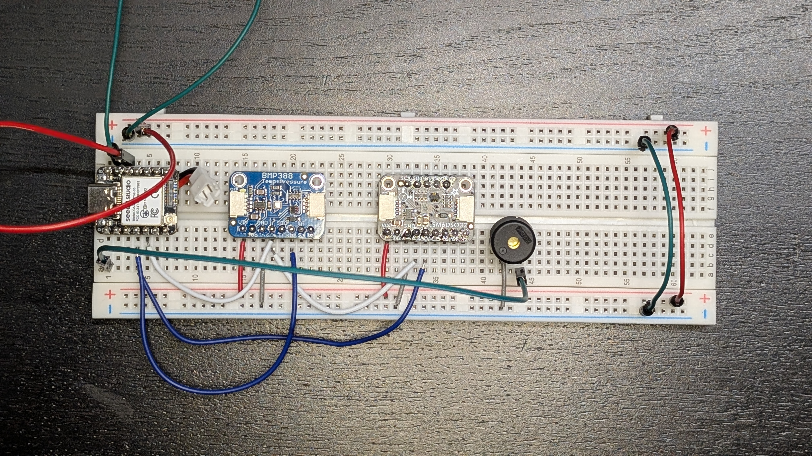
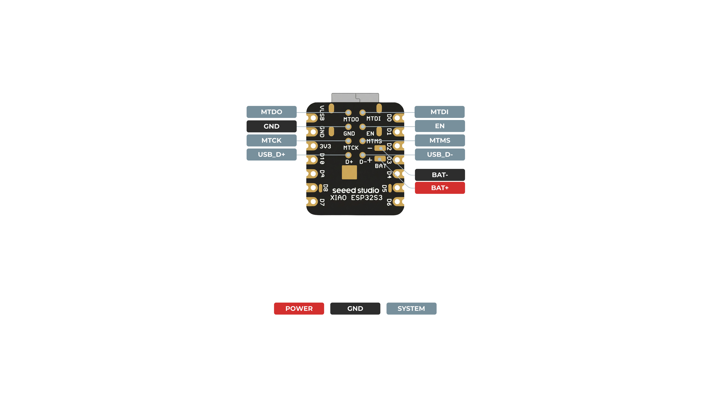
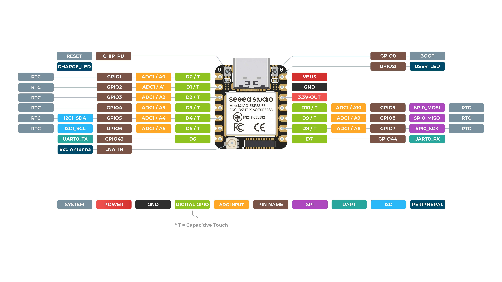
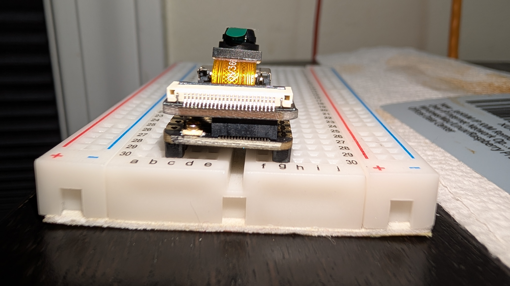

# XIAO ESP32S3 — cam

__The XIAO that carries the camera.__ The copy that arrived in the Sense kit.

__It arrived with no headers soldered on__ — the Sense kit ships its two 7-pin strips loose. With them fitted, it is indistinguishable from [the lora copy](../XIAO-ESP32S3-lora/XIAO-ESP32S3-lora.md), and the two have been swapped once already: tell them apart by what they run — [which XIAO is which](../XIAO-ESP32S3-lora/XIAO-ESP32S3-lora.md#which-xiao-is-this-one).

## What is mated to it

- __[Sense camera board](../Sense-camera-board/Sense-camera-board.md)__ — OV3660 camera and the microSD slot

Sensors reach it over __I2C on D4/D5__; the buzzer is __PWM on D0__. Flight firmware is __custom and not yet started__ ([#24](https://github.com/jwilleke/js-rocket-avionics/issues/24)); the bench runs [`bringup-cam`](../../firmware/bringup-cam/).

## On the bench



__It calls itself `mj-cam`__ — the name its firmware prints at start-up, and its Bluetooth name once firmware uses Bluetooth. The USB name cannot change: in this USB mode the chip always reports `USB JTAG_serial debug unit`. __This XIAO's chip MAC is `e0:72:a1:fa:41:30`__ — USB serial number `E0:72:A1:FA:41:30`. It ran Seeed's factory demo until 2026-09-12, when `bringup-cam` replaced it. [Which XIAO is which](../XIAO-ESP32S3-lora/XIAO-ESP32S3-lora.md#which-xiao-is-this-one).

__The photograph shows a wiring slip, since fixed.__ The two I2C wires sat on __D3/D4__, one pin short of D4/D5. `bringup-cam` then reports *nothing on the bus* while both sensors' power LEDs are lit. [`i2c-find`](../../firmware/i2c-find/) located them — pull-ups on D3 and D4, both sensors answering there — and moving each wire one pin away from the USB-C fixed it. __Count pins from the USB-C end: D0 is the first, D4 the fifth.__

__Bring-up, 2026-09-12__ ([#7](https://github.com/jwilleke/js-rocket-avionics/issues/7)), on USB — first without the Sense board, then with it:

| Check | Result |
|---|---|
| I2C | BMP388 at `0x77` and LSM6DSO32 at `0x6A`, no clash — details on each part's page |
| IMU at ±32 g, FIFO running | __pass__ — see [LSM6DSO32.md](../LSM6DSO32/LSM6DSO32.md#on-the-bench) |
| PSRAM | present, 8 384 784 bytes free |
| Camera + microSD | __pass__, second run with the Sense board and a FAT32 card: OV3660 (`0x3660`), 800 × 600 JPEG written — [Sense-camera-board.md](../Sense-camera-board/Sense-camera-board.md), [microSD.md](../microSD/microSD.md#on-the-bench). With no Sense board the driver says `Detected camera not supported` (`0x106`), not "not found": __misleading, it means nothing is there__ |
| Video to microSD | __pass__ — 24.7 fps at 800 × 600 with the SD clock at 20 MHz; 6.4 fps at the 4 MHz default. Worst card stall 570 ms — [microSD.md](../microSD/microSD.md#on-the-bench) |
| PSRAM log → card → read back | __pass__ — 3 s of FIFO words in a 1 MB PSRAM buffer, no overrun, flushed in 1.05 s, read back byte for byte |
| Buzzer | __works__ — measured by microphone, not by ear; strongest at 4 kHz. See [PS1240-buzzer.md](../PS1240-buzzer/PS1240-buzzer.md#on-the-bench--measured-not-listened-to) |

## Heights

__Datum: the bottom of the XIAO's PCB.__ Headers add __2.50 mm__ below it. Camera excluded.

| | Height | Above the carrier |
|---|---|---|
| A bare XIAO, to the top of the USB-C | __4.53 mm__ | 7.03 mm |
| __XIAO-ESP32S3-cam__ + [Sense camera board](../Sense-camera-board/Sense-camera-board.md) | __8.22 mm__ | __10.72 mm__ |
| __XIAO-ESP32S3-lora__ + [Wio-SX1262](../Wio-SX1262-LoRa/Wio-SX1262-LoRa.md) | __9.32 mm__ | __11.82 mm__ |

So the Sense camera board adds __3.69 mm__ to a XIAO and the Wio-SX1262 adds __4.79 mm__.

```text
XIAO-ESP32S3-cam 10.72 + carrier 1.00 + XIAO-ESP32S3-lora 11.82 = 23.54 mm
available = 2 x sqrt(19.7^2 - 8.75^2)                           = 35.30 mm

11.76 mm spare
```

## Photograph


## The module

Both copies are the same part — `Model: XIAO-ESP32-S3`, `FCC ID: Z4T-XIAOESP32S3` — and identical electrically. They differ only in what has been done to them and what is mated to them.

| | |
|---|---|
| Outline | __17.5 × 21 mm__ |
| Pads | __14 castellated__, two rows of 7, rows __17.0 mm apart__, pitch __2.54 mm__, pads 3 × 2 mm |
| Connectors | USB-C, __U.FL__, and the B2B connector an expansion board mates to |
| PSRAM | __8 MB__ (ESP32-S3R8) |
| Battery | __BAT+/BAT− are pads on the back face__ (footprint pads 16/17, 2.3 × 1.3 mm at x = −4.5), inboard of the `D3`/`D4` edge and __not on the castellated edge__ — see the drawing below |

## Things that will catch you

__The BAT pads are not on the castellated edge__, so the battery cannot reach this board through the headers. A soldered pigtail runs from the carrier's JST to those pads.

### Which face carries what — settled off Seeed's two drawings and the stack itself



__Back face__ — everything that is not a castellated pad: `BAT+`/`BAT−` inboard of the `D3`/`D4` edge, plus `MTDO`/`MTDI`/`MTCK`/`MTMS` (JTAG), `EN`, `D+`/`D−`, and a second `GND`.



__Front face__ — the RF shield, USB-C, and along the __bottom edge the U.FL socket beside the B2B connector__. __The B2B is on the front.__ So the expansion board mates to the __front__, and the back face stays open.



__The end-on view is the proof__, and it reads bottom to top: breadboard, header pins, __the XIAO__, the dark B2B block, __the expansion board__ with its white camera-ribbon socket, then the camera on its flex. The expansion board is above; the XIAO's back face points down at the breadboard, uncovered.

### So what actually blocks the BAT pads

__Not the expansion board.__ It mates to the front and never touches them — it can go on and come off with the pigtails already fitted.

__The carrier does, and permanently.__ Once the XIAO is on its two 1×7 strips, the back face sits __~2.50 mm__ off the carrier, and no iron reaches into 2.50 mm. On the bench that same face is against the breadboard, so pull the XIAO out rather than working under a seated module.

__Solder the pigtails before the XIAO goes onto its headers.__ That is the real ordering rule. Seeed's wiki is read as warning about the expansion board; on this board that is not where the obstruction is.

> __Consequence nobody had written down: the pigtails have to leave through that 2.50 mm gap.__ Two wires run from inboard pads on the back, out through one open end of the module (both long sides are walled by header plastic; see the [carrier layout](../PCB-carrier/PCB-carrier.md#layout-as-far-as-it-is-fixed)), to the JST. Route and dress them before the XIAO goes down — they must not foul the pins, and they must not sit on carrier copper. Thin, flexible, and tacked down.

__This is also the answer to "above or beneath".__ The expansion board mates to the __front face__ and sits __above__ the XIAO, exactly as [design.md](../../docs/design.md) says. The Population tables that read *"Wio-SX1262 beneath it"* were the wrong ones.

__On battery power there is no voltage on the 5V pin__, so nothing can be fed from this board's 5V rail.

__Both XIAO chargers sit in parallel on one battery — charge through one USB port at a time.__

__Reversing a LiPo into a XIAO destroys it.__ The carrier silkscreens the pigtail polarity.

__The expansion board is the same outline as the XIAO__ (±8.75 mm against pads at ±8.5). Two consequences: no carrier cutout can clear one, because any hole wide enough removes the copper the pads solder to — and it covers the whole back face, which is what puts the BAT pads out of reach above.

---

Part numbers, vendors and masses live in [BOM.md](../../docs/BOM.md), which is the single source of truth for both. Purchase history is in [shopping-list.md](../../docs/shopping-list.md); the reasoning is in [design.md](../../docs/design.md).

## BAT PADs

- Center-to-center ≈ 2.1 mm
- Each pad about 2.4 × 1.2 mm
